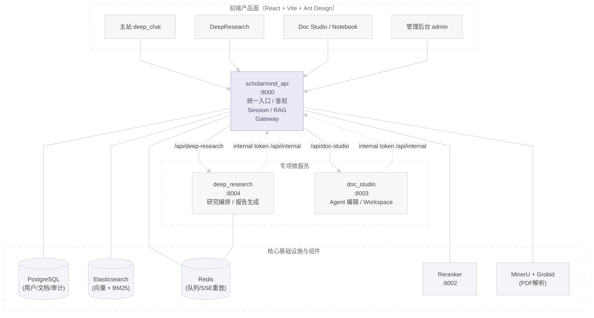
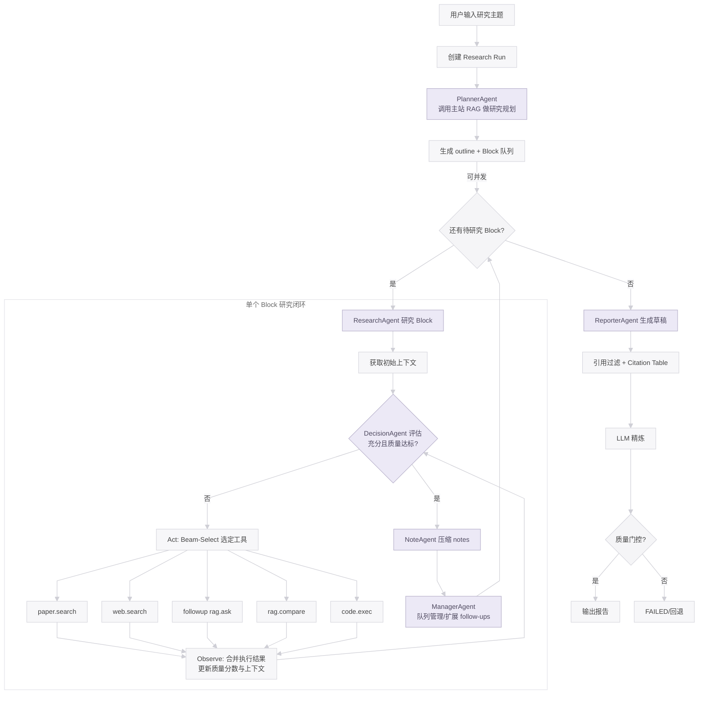
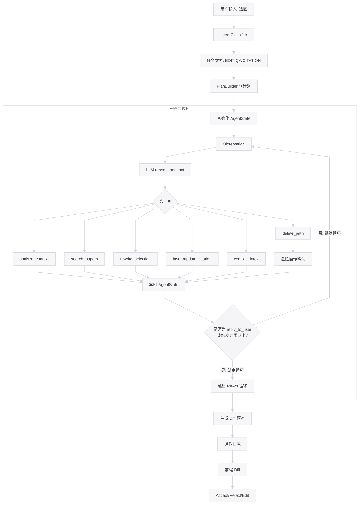

# ScholarMind 🧠

> 面向学术研究者的 AI 助手平台：六层多策略 RAG、DeepResearch 多轮闭环 Agent、Doc Studio ReAct 智能编辑。

---

## 🎯 在线演示

**[https://demo-scholarmind.wh5233.me](https://demo-scholarmind.wh5233.me)**

体验 RAG 问答、DeepResearch 文献综述、Doc Studio 智能编辑，即刻开始无需本地部署。⭐ 若对你有帮助，欢迎 Star

---

[](https://github.com/wanghong5233/ScholarMind)
[](https://opensource.org/licenses/MIT)
[](https://www.python.org/downloads/)
[](https://fastapi.tiangolo.com/)
[](https://react.dev/)
[](https://docs.docker.com/compose/)

[English](README_EN.md) | **中文**

ScholarMind 采用**四服务微服务架构**，集成生产级 RAG 检索管线、DeepResearch 深度研究 Agent 和 Doc Studio 文档智能编辑 Agent，支持论文理解、文献综述、学术写作和知识库管理。**功能预览**：RAG 对话、DeepResearch 报告、Doc Studio 编辑 → [在线演示](https://demo-scholarmind.wh5233.me)

---

## 目录

- [在线演示](#-在线演示)
- [架构总览](#架构总览)
- [核心模块](#核心模块)
  - [RAG 检索增强](#1-rag-检索增强)
  - [DeepResearch 深度研究](#2-deepresearch-深度研究)
  - [Doc Studio 智能编辑](#3-doc-studio-智能编辑)
- [快速开始](#快速开始)
  - [故障排查](#故障排查)
- [技术栈](#技术栈)
- [架构亮点](#架构亮点)
- [开源协议](#开源协议)

---

## 架构总览



| 服务 | 端口 | 职责 |
|------|------|------|
| `scholarmind_api` | 8000 | 主 API：用户认证、RAG 对话、Session 管理、文档处理 |
| `deep_research` | 8004 | DeepResearch Agent：多轮研究、队列调度、报告生成 |
| `doc_studio` | 8003 | Doc Studio Agent：LaTeX/Markdown 编辑、文件系统、HitL 确认 |
| `reranker` | 8002 | Cross-Encoder 精排 |

---

## 核心模块

### 1. RAG 检索增强

六层多策略检索管线，支持会话内文档与用户知识库的混合检索。

| 阶段 | 说明 |
|------|------|
| **Query Variants** | CJK 自动翻译、Multi-Query 改写、HyDE 假设文档 |
| **多路检索** | BM25 + 向量 × N variants × M indices（session_only / global_only / hybrid） |
| **RRF 融合** | 基于排名的量纲无关融合 |
| **MMR 多样性** | Jaccard token 相似度，平衡相关性与多样性 |
| **公式上下文扩展** | 公式 chunk 前后各 2 块纳入，保证定义与解释完整 |
| **Metadata 重排** | 年份、引用数、章节、知识图谱 boost、多模态元素 |
| **Cross-Encoder 精排** | BGE-Reranker-Large INT8 最终排序 |

**文档摄入**：MinerU 高保真解析 → Grobid 学术元数据 → 策略感知分块 → Embedding → ES 双索引。

**SSE 事件序列**：`progress.accepted` → `progress.history`（STM）→ `progress.memory`（LTM）→ `progress.retrieving` → `progress.rerank` → `delta.*`（流式 token）→ `completion`。支持 `Last-Event-ID` 断线重放。

**记忆**：Session KB（会话内文档）+ 用户知识库（RAG 可选）+ STM（近期历史）+ LTM（跨会话长期记忆）。

**Session KB 与用户知识库**：Session KB 是每个会话专属的文档库，随会话生命周期管理；用户知识库是自建的跨会话知识库，RAG 开启时参与检索，二者独立。

---

### 2. DeepResearch 深度研究

多轮闭环 Agent 系统，用于论文深度研究、文献综述和报告生成。

**六层 Agent 体系**：

| Agent | 职责 |
|-------|------|
| **PlannerAgent** | RAG 辅助生成 JSON 研究计划 |
| **ResearchAgent** | Beam-Select 动作评分、CJK 剥离+锚点注入、多轮 Observe→Decide→Act |
| **NoteAgent** | 将 summary 压缩为 bullet notes，控制 Reporter 输入 token |
| **DecisionAgent** | 证据质量评估（sufficient / followup / tool_calls），三层 LLM 容错 |
| **ManagerAgent** | 自适应话题扩展，防队列停滞 |
| **ReporterAgent** | 分节生成、引用过滤、量化质量门控 |

**工具**：`paper.search`（Semantic Scholar + arXiv）、`web.search`、`rag.ask`、`rag.compare`、`web.open_page`、`code.exec` 等。

**弹性设计**：租约调度、Watchdog 超时、断点续跑、SSE 全链路可观测。`MAX_ACTIVE_RUNS=2` 全局并发上限，超出入队；优先级 + Aging 防饥饿；租约续约失败 → 实例宕机保护，自动取消并重入队。

**引用质量**：两层漏斗（严格层 + relaxed 层），学术域名（arxiv、semanticscholar 等）豁免 topic overlap 检查；质量门控（最少段落、最少引用、引用段落覆盖率）未达标则 run 标记 FAILED。

下图用于直观展示 DeepResearch 多 Agent 的主干闭环，便于快速理解规划、研究、扩展和报告生成之间的关系：



---

### 3. Doc Studio 智能编辑

体验参考 Cursor，侧重 LaTeX/Markdown 等文档的智能编辑。ReAct 推理循环 + Human-in-the-loop 危险操作确认。

| 能力 | 说明 |
|------|------|
| **Ask/Agent 双模式** | Ask 只读分析；Agent 全工具链执行 |
| **动态工具编排** | 定位→读片段→精确改写，16 种工具独立预算守卫 |
| **Human-in-the-loop** | 危险操作（如批量删除）需用户确认；asyncio.Future 挂起，最长 900s 等待 |
| **语义混合检索** | embedding + lexical n-gram，增量索引与冷启动预热 |
| **异步可取消** | SSE 全链路事件，支持中断与断线重连回放 |
| **多模态** | 图片附件自动切换 vision 模型 |
| **LaTeX CJK** | Unicode/CJK 检测自动注入 ctex，保证中文编译 |

**Notebook**：Doc Studio 的 workspaceId=`notebook` 特例，支持 DeepResearch 报告一键导入。系统目录（如 `_system/auto_notes/`）结构只读，文件可删；用户目录完全自由。

**approval_token 安全**：危险删除操作路径绑定、单次消费（`pop()`）、TTL 过期清理，防重放。

下图用于概括 Doc Studio 单 Agent 的 ReAct 编辑循环，展示从意图识别、计划生成到工具执行和 Diff 交付的完整链路：



---

## 快速开始

**环境**：Docker Compose、8GB+ RAM、NVIDIA GPU（无 GPU 见[故障排查](#故障排查)）、DashScope API Key

```bash
git clone https://github.com/wanghong5233/ScholarMind.git
cd ScholarMind/backend
cp .env.example .env
# 编辑 .env，至少配置：DASHSCOPE_API_KEY、JWT_SECRET_KEY、ELASTIC_PASSWORD
make up-build && make migrate
cd ../frontend && npm run dev   # 前端单独启动
```

**访问**：前端 http://localhost:5173 | API 文档 http://localhost:8000/docs

**必填环境变量**：`DASHSCOPE_API_KEY`、`JWT_SECRET_KEY`（`python -c "import secrets; print(secrets.token_hex(32))"` 生成）、`ELASTIC_PASSWORD`（8 位+）。可选：`SEMANTIC_SCHOLAR_API_KEY`、`TAVILY_API_KEY`/`SERPER_API_KEY`。详见 `backend/.env.example`。

**常用命令**：`make up` 启动 | `make down` 停止 | `make logs-api` 日志

### 故障排查

| 现象 | 处理 |
|------|------|
| MinerU/Reranker 启动失败（无 GPU） | 在 `docker-compose.yml` 中：`mineru`、`reranker` 的 `dockerfile` 改为 `Dockerfile`，并注释 `deploy.resources.reservations`。Reranker 可用 DashScope 云端；MinerU 无 GPU 时解析受限 |
| Elasticsearch 超时 | 确保 `.env` 中 `ELASTIC_PASSWORD` 已设置，ES 首次启动约 2–3 分钟 |
| 前端空白 / 401 | 检查 `JWT_SECRET_KEY` 与后端一致 |
| PDF 解析失败 | MinerU 需 GPU，确认 NVIDIA 驱动与 Container Toolkit 已安装 |

---

## 技术栈

| 层级 | 技术 |
|------|------|
| **后端** | FastAPI、Python 3.11+、SQLAlchemy、Alembic |
| **数据库** | PostgreSQL 15、Elasticsearch 8.x、Redis 7 |
| **前端** | React 18、TypeScript、Ant Design、Valtio |
| **AI** | DashScope / OpenAI（Embedding、LLM）、BGE-Reranker、MinerU、Grobid |
| **运维** | Docker Compose |

---

## 架构亮点

| 亮点 | 说明 |
|------|------|
| **三层鉴权** | User Token（7 天）/ Admin Token（2 小时）/ Internal Service Token（服务间），完全解耦 |
| **SSE 鉴权** | `EventSource` 无法带 Header → 支持 `?token=` query param 传 JWT，生产环境需 HTTPS |
| **per-session 流控制** | `AskRunControl` 确保同 session 同一时刻最多一个活跃 ask，新请求协作取消旧流 |
| **断线重放** | `AskStreamReplayBuffer` 双后端（内存 + Redis），`Last-Event-ID` 协议无感续流 |
| **产品面隔离** | `sessions.surface` 区分 deep_chat / doc_studio，硬隔离会话宇宙 |
| **GraphRAG** | 实体提取 → 图谱节点匹配 → `boost_chunk_ids` 传入 RAG Metadata 阶段 |
| **MinerU + Grobid** | 双引擎对齐，高保真学术 PDF 解析（版面 + 元数据） |

---

## 开源协议

本项目采用 [MIT License](./LICENSE)。  
如对你有帮助，欢迎 ⭐ [Star](https://github.com/wanghong5233/ScholarMind) 支持。
