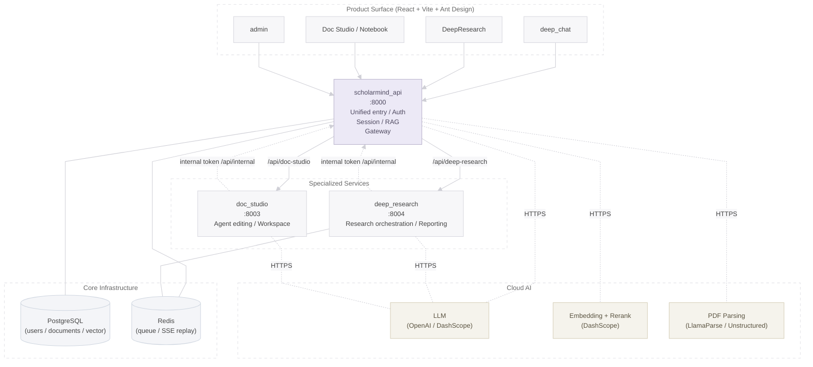
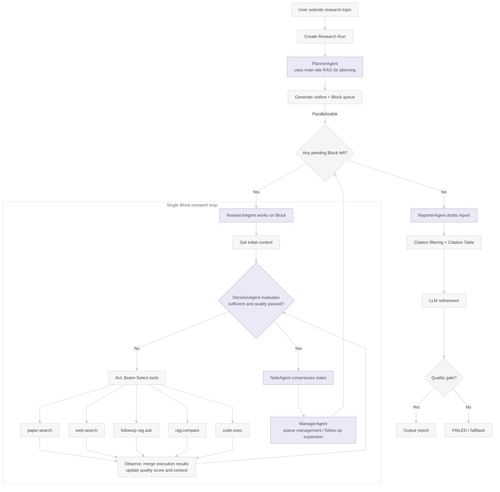
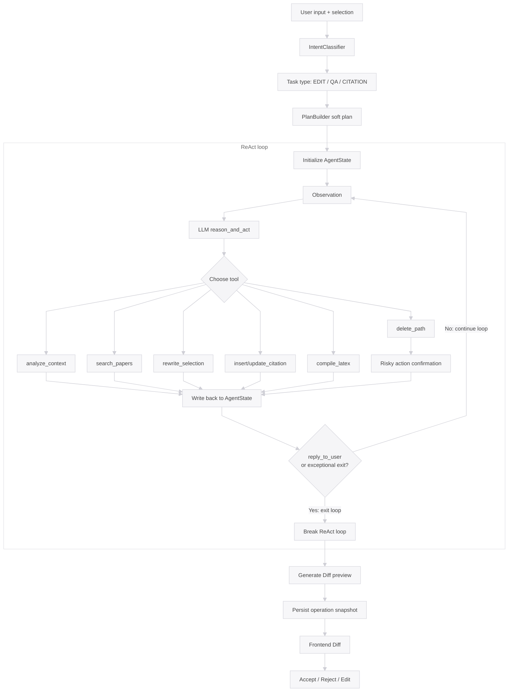

# ScholarMind

> AI assistant platform for researchers: multi-stage hybrid-retrieval RAG, DeepResearch closed-loop Agent, and Doc Studio ReAct editing.

---

## Try Online

**[https://scholarmind.wh5233.me/demo](https://scholarmind.wh5233.me/demo)**

Try RAG Q&A, DeepResearch literature review, and Doc Studio editing without local deployment.

---

[](https://github.com/wanghong5233/ScholarMind)
[](https://opensource.org/licenses/MIT)
[](https://www.python.org/downloads/)
[](https://fastapi.tiangolo.com/)
[](https://react.dev/)
[](https://docs.docker.com/compose/)

**English** | [中文](README.md)

ScholarMind uses a **three-service microservice architecture** (main API + DeepResearch + Doc Studio), integrating production-grade RAG retrieval, DeepResearch research Agent, and Doc Studio document editing Agent for paper understanding, literature review, academic writing, and knowledge base management. Try online: RAG chat, DeepResearch reports, Doc Studio editing → [Try Online](https://scholarmind.wh5233.me/demo)

---

## Table of Contents

- [Try Online](#try-online)
- [Architecture Overview](#architecture-overview)
- [Core Modules](#core-modules)
  - [RAG Retrieval](#1-rag-retrieval)
  - [DeepResearch](#2-deepresearch)
  - [Doc Studio](#3-doc-studio)
- [Quick Start](#quick-start)
  - [Troubleshooting](#troubleshooting)
- [Tech Stack](#tech-stack)
- [Architecture Highlights](#architecture-highlights)
- [License](#license)

---

## Architecture Overview



| Service | Port | Role |
|---------|------|------|
| `scholarmind_api` | 8000 | Main API: auth, RAG chat, session management, document processing |
| `deep_research` | 8004 | DeepResearch Agent: multi-turn research, queue scheduling, report generation |
| `doc_studio` | 8003 | Doc Studio Agent: LaTeX/Markdown editing, file system, HitL confirmation |

MinerU / Grobid / local Reranker remain available as optional GPU-heavy services and are not enabled by default in production.

---

## Core Modules

### 1. RAG Retrieval

Multi-stage hybrid retrieval pipeline over in-session documents and user knowledge bases.

| Stage | Description |
|-------|-------------|
| **Query Variants** | CJK translation, Multi-Query rewriting, HyDE hypothetical documents |
| **Multi-path retrieval** | BM25 + vector × N variants × M indices (session_only / global_only / hybrid) |
| **RRF fusion** | Rank-based dimension-agnostic fusion |
| **MMR diversity** | Jaccard token similarity for relevance vs. diversity balance |
| **Formula context expansion** | ±2 chunks around formula chunks for definitions and explanations |
| **Metadata reranking** | Year, citation count, section, knowledge graph boost, multimodal |
| **Cloud reranking** | DashScope Rerank for final ordering |

**Document ingestion**: LlamaParse → Unstructured API → PyMuPDF three-tier parsing → strategy-aware chunking → Embedding → pgvector dual index.

**SSE event sequence**: `progress.accepted` → `progress.history` (STM) → `progress.memory` (LTM) → `progress.retrieving` → `progress.rerank` → `delta.*` (streaming tokens) → `completion`. Supports `Last-Event-ID` reconnection replay.

**Memory**: Session KB (in-session docs) + User KB (optional RAG) + STM (recent history) + LTM (cross-session long-term memory).

**Session KB vs User KB**: Session KB is per-session; User KB is cross-session. Both are independent.

---

### 2. DeepResearch

Closed-loop Agent system for deep paper research, literature review, and report generation.

**Six-layer Agent system**:

| Agent | Role |
|-------|------|
| **PlannerAgent** | RAG-aided JSON research plan generation |
| **ResearchAgent** | Beam-Select action scoring, CJK stripping + anchor injection, Observe→Decide→Act loop |
| **NoteAgent** | Compresses summary into bullet notes for Reporter input token control |
| **DecisionAgent** | Evidence quality (sufficient / followup / tool_calls), three-layer LLM fallback |
| **ManagerAgent** | Adaptive topic expansion, prevents queue stall |
| **ReporterAgent** | Section-wise generation, citation filtering, quality gates |

**Tools**: `paper.search` (Semantic Scholar + arXiv), `web.search`, `rag.ask`, `rag.compare`, `web.open_page`, `code.exec`, etc.

**Resilience**: Lease scheduling, watchdog timeout, checkpoint resume, full-chain SSE observability. `MAX_ACTIVE_RUNS=2` global concurrency; overflow enqueued; priority + aging prevents starvation.

**Citation quality**: Two-layer funnel; academic domains exempt; quality gates (min paragraphs, citations, coverage); FAILED if unmet.

The diagram below shows the main closed loop of the DeepResearch multi-agent workflow, making it easier to understand how planning, research, expansion, and reporting fit together:



---

### 3. Doc Studio

Cursor-like LaTeX/Markdown intelligent editing. ReAct loop + Human-in-the-loop confirmation for risky actions.

| Capability | Description |
|------------|-------------|
| **Ask/Agent modes** | Ask: read-only analysis; Agent: full toolchain execution |
| **Dynamic tool orchestration** | Locate → read segment → precise rewrite; 16 tools with per-tool budget guards |
| **Human-in-the-loop** | Risky ops (e.g., bulk delete) require confirmation; asyncio.Future suspend, up to 900s |
| **Semantic hybrid search** | embedding + lexical n-gram, incremental index + cold-start prewarm |
| **Async cancellable** | SSE events, interrupt and reconnect replay |
| **Multimodal** | Image attachments auto-switch to vision model |
| **LaTeX CJK** | Unicode/CJK detection auto-injects ctex for Chinese compilation |

**Notebook**: Doc Studio workspaceId=`notebook` for DeepResearch report one-click import. System dirs read-only; user dirs fully writable.

**approval_token security**: Path-bound, single-use (`pop()`), TTL cleanup, replay-resistant.

The diagram below summarizes the single-agent ReAct editing loop in Doc Studio, from intent recognition and plan construction to tool execution and Diff delivery:



---

## Quick Start

**Requirements**: Docker Compose, 4GB+ RAM, DashScope / OpenAI / LlamaParse API keys.

```bash
git clone https://github.com/wanghong5233/ScholarMind.git
cd ScholarMind/backend
cp .env.example .env
# Edit .env: DASHSCOPE_API_KEY, OPENAI_API_KEY, SM_LLAMA_PARSE_API_KEY, JWT_SECRET_KEY
make up-build && make migrate
cd ../frontend && npm run dev   # frontend separate
```

**Access**: Frontend http://localhost:5173 | API docs http://localhost:8000/docs

**Required env vars**: `DASHSCOPE_API_KEY`, `OPENAI_API_KEY`, `SM_LLAMA_PARSE_API_KEY`, `JWT_SECRET_KEY` (`python -c "import secrets; print(secrets.token_hex(32))"`). Optional: `SEMANTIC_SCHOLAR_API_KEY`, `TAVILY_API_KEY`/`SERPER_API_KEY`. See `backend/.env.example`.

**Commands**: `make up` start | `make down` stop | `make logs-api` logs

Cloud deployment: see [docs/LOW_COST_CLOUD_DEPLOYMENT_MANUAL.md](./docs/LOW_COST_CLOUD_DEPLOYMENT_MANUAL.md).

### Troubleshooting

| Issue | Solution |
|-------|----------|
| Blank frontend / 401 | Ensure `JWT_SECRET_KEY` matches backend and CORS origin is configured |
| PDF parsing fails | Verify `SM_LLAMA_PARSE_API_KEY`; falls back LlamaParse → Unstructured → PyMuPDF |
| LLM long no response | Configure `OPENAI_BASE_URL` to route via Cloudflare AI Gateway |
| Container stuck on `nltk_data Downloading` | Pre-fetch with `backend/scripts/prepare_nltk_data.sh` and volume-mount |
| Enable local GPU stack (MinerU / Grobid / Reranker) | Optional services; comment out `deploy.resources.reservations` without GPU |

---

## Tech Stack

| Layer | Technology |
|-------|------------|
| **Backend** | FastAPI, Python 3.11+, SQLAlchemy, Alembic |
| **Database** | PostgreSQL 15 + pgvector, Redis 7 |
| **Frontend** | React 18, TypeScript, Ant Design, Valtio |
| **AI** | DashScope / OpenAI (Embedding, LLM, Rerank), LlamaParse, Unstructured |
| **Ops** | Docker Compose, Cloudflare Tunnel, Vercel |

---

## Architecture Highlights

| Highlight | Description |
|-----------|-------------|
| **Three-layer auth** | User Token (7 days) / Admin Token (2h) / Internal Service Token, fully decoupled |
| **SSE auth** | EventSource cannot send headers; supports `?token=` query param (HTTPS recommended) |
| **per-session flow control** | `AskRunControl` ensures at most one active ask per session; new request cancels previous |
| **Reconnection replay** | `AskStreamReplayBuffer` (memory + Redis), `Last-Event-ID` seamless replay |
| **Product isolation** | `sessions.surface` separates deep_chat / doc_studio |
| **GraphRAG** | Entity extraction → graph node match → `boost_chunk_ids` in RAG metadata |
| **Three-tier parsing fallback** | LlamaParse → Unstructured → PyMuPDF; cloud-first, local fallback, no GPU |
| **Provider-level circuit breaker** | A connectivity error from any LLM provider in a single request skips all its remaining models and switches to the next provider |

---

## License

[MIT License](./LICENSE).  
If this helps you, consider ⭐ [Star](https://github.com/wanghong5233/ScholarMind).
