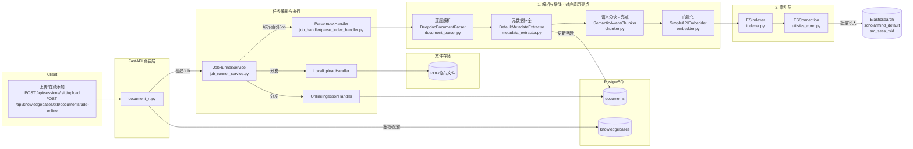
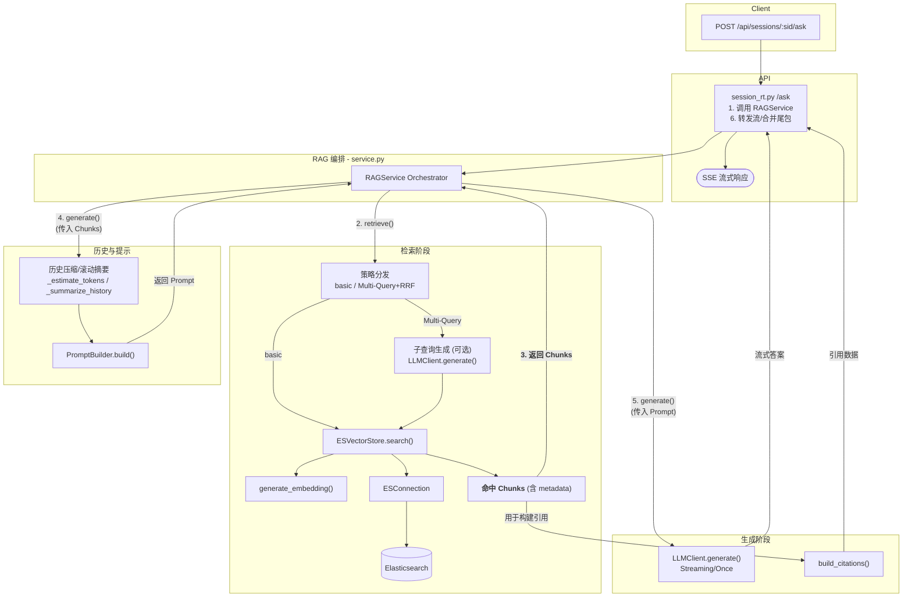

**第一幅图（索引与入库）- 已修正**

```mermaid
flowchart LR
  %% 索引与入库

  subgraph Client [Client]
    UPL["上传/在线添加<br/>POST /api/sessions/:sid/upload<br/>POST /api/knowledgebases/:kb/documents/add-online"]
  end

  subgraph API [FastAPI 路由层]
    DOCRT[document_rt.py]
  end

  subgraph JOB [任务编排与执行]
    JR["JobRunnerService<br/>job_runner_service.py"]
    LH["LocalUploadHandler"]
    OH["OnlineIngestionHandler"]
    PIH["ParseIndexHandler<br/>job_handler/parse_index_handler.py"]
  end
  
  subgraph DB [PostgreSQL]
    DOCS[(documents)]
    KBS[(knowledgebases)]
  end

  subgraph FS [文件存储]
    FILES[(PDF/临时文件)]
  end

  subgraph PARSE [1. 解析与增强 - 对应简历亮点]
    P1["深度解析<br/>DeepdocDocumentParser<br/>document_parser.py"]
    P2["元数据补全<br/>DefaultMetadataExtractor<br/>metadata_extractor.py"]
    P3["语义分块 - 亮点<br/>SemanticAwareChunker<br/>chunker.py"]
    P4["向量化<br/>SimpleAPIEmbedder<br/>embedder.py"]
  end

  subgraph INDEX [2. 索引层]
    ESX["ESIndexer<br/>indexer.py"]
    ESC["ESConnection<br/>utils/es_conn.py"]
  end

  %% --- 定义连接关系 ---
  UPL --> DOCRT
  DOCRT -->|创建Job| JR
  JR -->|分发| LH & OH
  LH --> FILES
  OH --> DOCS
  DOCRT -->|鉴权/配额| KBS

  JR -->|解析/索引Job| PIH
  PIH --> P1
  P1 --> P2
  P2 --> P3
  P3 --> P4
  P4 --> ESX
  
  P2 -->|更新字段| DOCS
  
  ESX --> ESC
  ESC -->|批量写入| ES[(Elasticsearch<br/>scholarmind_default<br/>sm_sess_:sid)]

```

第二幅图（RAG编排）- 已修正

```mermaid
graph TD
    subgraph Client
        A[POST /api/sessions/:sid/ask]
    end

    subgraph API
        B["session_rt.py /ask<br>1. 调用 RAGService<br>6. 转发流/合并尾包"]
        F([SSE 流式响应])
    end

    subgraph "RAG 编排 - service.py"
        C["RAGService Orchestrator"]
    end
    
    A --> B --> C

    subgraph "检索阶段"
        D["策略分发<br>basic / Multi-Query+RRF"]
        E["子查询生成 (可选)<br>LLMClient.generate()"]
        G["ESVectorStore.search()"]
        H["generate_embedding()"]
        I["ESConnection"]
        P[("Elasticsearch")]
        J["<b>命中 Chunks</b> (含 metadata)"]
    end

    subgraph "历史与提示"
        K["历史压缩/滚动摘要<br>_estimate_tokens / _summarize_history"]
        L["PromptBuilder.build()"]
    end

    subgraph "生成阶段"
        M["LLMClient.generate()<br>Streaming/Once"]
        N["build_citations()"]
    end

    %% Flow
    C -- "2. retrieve()" --> D
    D -- "Multi-Query" --> E
    D -- "basic" --> G
    E --> G
    G --> H & I
    I --> P
    G --> J
    
    J -- "<b>3. 返回 Chunks</b>" --> C
    
    C -- "4. generate() <br> (传入 Chunks)" --> K
    K --> L
    L -- "返回 Prompt" --> C
    
    C -- "5. generate() <br> (传入 Prompt)" --> M
    
    J -- "用于构建引用" --> N
    
    M -- "流式答案" --> B
    N -- "引用数据" --> B
    B --> F
```