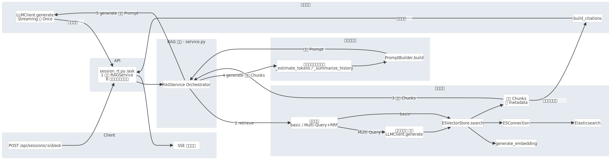

# ScholarMind 后端服务 - README

本文档为 ScholarMind 后端服务的技术参考与开发指南，旨在帮助开发者快速理解系统架构、核心流程与关键组件。

## 1. 项目概述

ScholarMind 后端是一个基于 **FastAPI** 构建的 Python 服务，旨在为学术研究场景提供强大的 **检索增强生成 (RAG)** 能力。它集成了文档解析、元数据增强、向量化、多策略检索、多轮对话与可观测性等一系列功能，为前端应用提供稳定、高效的 API 支持。

**核心技术栈**:
- **Web 框架**: FastAPI
- **数据库**: PostgreSQL (with SQLAlchemy ORM & Alembic)
- **向量存储**: Elasticsearch
- **异步任务**: FastAPI BackgroundTasks
- **PDF 解析**: `deepdoc` & `PyMuPDF`
- **RAG 核心**: 自研编排（支持 Multi-Query+RRF, 语义分块, 多模态信息提取）

## 2. 核心特性

- **模块化索引流水线**: 支持本地/在线文档入库，集成深度解析、元数据补全、语义分块与多模态信息提取。
- **层次化 RAG 架构**: 从“多路召回”到“RL 精排”，全链路优化检索质量。
- **多轮对话与上下文管理**: 支持长会话的 Token 预算控制与滚动摘要。
- **可配置与可观测**: 通过特征旗标 (Feature Flags) 实现策略灰度，通过结构化日志与指标接口保障系统可维护性。
- **产品化 API**: 提供跨论文对比、批判性问题生成等实用功能。

## 3. 技术架构详解

系统核心架构分为两大流程：**索引与入库 (Indexing)** 和 **RAG 编排 (Orchestration)**。

### 3.1 索引与入库流程

此流程负责将用户上传的原始文档（PDF/DOCX/TXT）处理成可供检索的向量化数据，并存入 Elasticsearch。整个过程是异步的、模块化的，并通过任务队列进行调度。


**流程解读**:
1.  **客户端入口**: 用户通过 `POST /api/sessions/:sid/upload` (会话内上传) 或 `POST /api/knowledgebases/:kb/documents/add-online` (知识库在线添加) 发起请求。
2.  **API 路由层**: `document_rt.py` 接收请求，进行基础校验（权限、配额），然后创建一个异步 `Job`。
3.  **任务编排**: `JobRunnerService` 接收到 Job 后，根据其类型（如 `UPLOAD_LOCAL`）将其分发给对应的处理器（`LocalUploadHandler`）。
4.  **文件处理与持久化**: Handler 负责将文件存入**文件存储 (FS)**，并在 **PostgreSQL (DB)** 的 `documents` 表中创建记录。
5.  **解析与增强**: `JobRunnerService` 随后调度 `ParseIndexHandler`，启动核心的 RAG 索引流水线：
    *   **P1 - 深度解析**: `DeepdocDocumentParser` 利用视觉与 NLP 模型解析 PDF，提取文本块、布局信息及图表。
    *   **P2 - 元数据补全**: `DefaultMetadataExtractor` 从解析内容中提取标题、作者、DOI 等，并通过 Semantic Scholar API 补全引文信息，更新 `documents` 表。
    *   **P3 - 语义分块 (亮点)**: `SemanticAwareChunker` 基于句向量相似度对文本进行语义连贯的切块，同时支持多模态信息（图表标题）作为独立 Chunk。
    *   **P4 - 向量化**: `SimpleAPIEmbedder` 将所有 Chunks 文本批量转换为向量。
6.  **索引层**: `ESIndexer` 将携带元数据和向量的 Chunks 批量写入 **Elasticsearch**。索引名根据场景区分：
    *   `scholarmind_default`: 默认知识库索引。
    *   `sm_sess_:sid`: 会话级临时索引，用于即时上传、即时问答。

### 3.2 RAG 编排与问答流程

当用户在会话中提问时，此流程负责调度检索与生成模块，以流式 (SSE) 或非流式的方式返回精准答案。



**流程解读**:
1.  **客户端入口**: 用户通过 `POST /api/sessions/:sid/ask` 发起问答请求。
2.  **API 路由层**: `session_rt.py` 的 `/ask` 端点接收请求，负责：
    *   调用 `RAGService` 核心服务。
    *   处理流式响应 (SSE)，将生成器吐出的数据块转发给客户端。
    *   在流结束时，将引用 (Citations) 和用量 (Usage) 等元信息作为尾包发送。
3.  **RAG 编排层**: `RAGService` 是整个流程的大脑，负责：
    *   **2. 检索 (retrieve)**: 根据配置的策略（如 `multi_query`）进行检索。
        *   **Multi-Query**: 调用 LLM 将原问题扩展为多个子查询。
        *   **ESVectorStore**: 对每个查询执行向量检索，并使用 **RRF (Reciprocal Rank Fusion)** 算法融合多路结果，得到高质量的 Chunks 候选集。
    *   **3. 返回 Chunks**: 将命中的 Chunks 返回给编排层。
    *   **4. 历史与提示构建 (generate)**:
        *   **历史压缩**: 根据 Token 预算，对长对话历史进行“滚动摘要”或“近期裁剪”。
        *   **Prompt 构建**: `PromptBuilder` 将系统指令、压缩后的历史、检索到的 Chunks 和用户问题组装成最终的 Prompt。
    *   **5. 生成 (generate)**:
        *   `LLMClient` 将 Prompt 发送给底层大模型（如 DashScope/OpenAI），获取流式或一次性答案。
        *   `build_citations` 从命中的 Chunks 中提取并构建结构化的引用信息。

## 4. 环境配置与启动

1.  **配置文件**: 项目配置集中在 `backend/app/core/config.py`，通过 `.env` 文件进行覆盖。请参考 `.env.example` 创建您的本地 `.env` 文件，并填入必要的密钥（`DASHSCOPE_API_KEY` 等）和数据库连接信息。

2.  **启动服务**: 项目使用 Docker Compose 进行容器化编排。在项目根目录下执行：
    ```bash
    docker compose up -d --build
    ```
    此命令会构建并启动所有服务，包括 API 服务、PostgreSQL 数据库、Elasticsearch 和 Redis。

3.  **查看日志**:
    ```bash
    docker compose logs -f scholarmind_api
    ```

## 5. API 接口约定

- **认证**: 大部分接口需要通过 `Authorization: Bearer <token>` Header 进行 JWT 认证。Token 可通过 `/api/users/login` 接口获取。
- **统一前缀**: 所有 API 均以 `/api` 开头。
- **文档**: API 的交互式文档 (Swagger UI) 可在服务启动后访问 `http://localhost:8000/docs` 查看。

## 6. 数据库迁移

数据库模式的变更通过 Alembic 进行管理。详细操作请参见 `backend/app/alembic/README.md`。

## 7. 开发与调试

- **结构化日志**: 所有服务均输出结构化的 JSON 日志，便于日志聚合与分析。请求日志中包含唯一的 `request_id`。
- **特征开关**: 可通过 `/api/config/feature-flags` 接口查看当前生效的 RAG 策略与功能开关，便于灰度发布与 A/B 测试。
- **健康检查**: `/api/config/parsing-health` 接口提供了对 `deepdoc`, `nltk` 等核心解析依赖的轻量健康检查。
