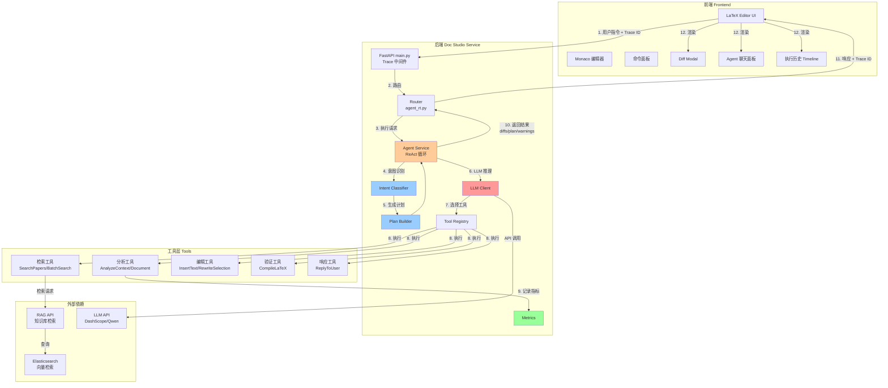
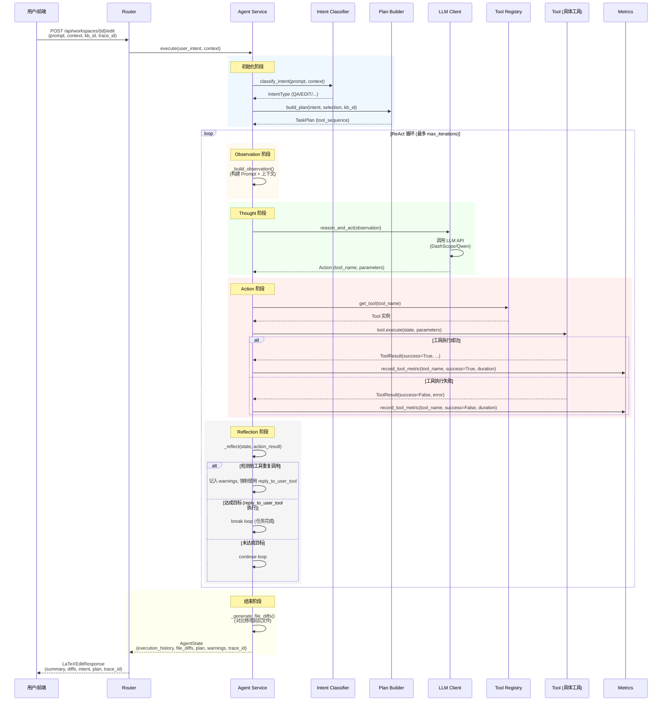
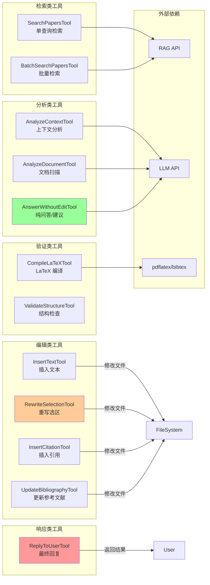
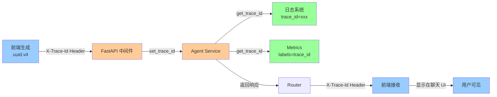
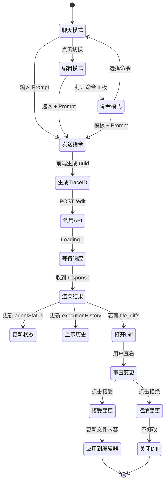
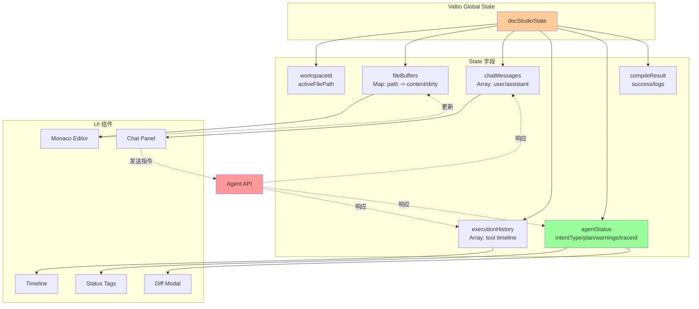
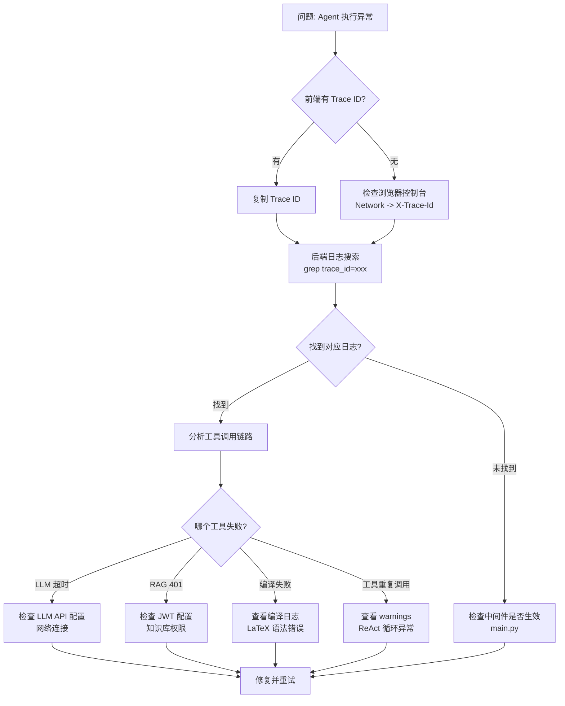
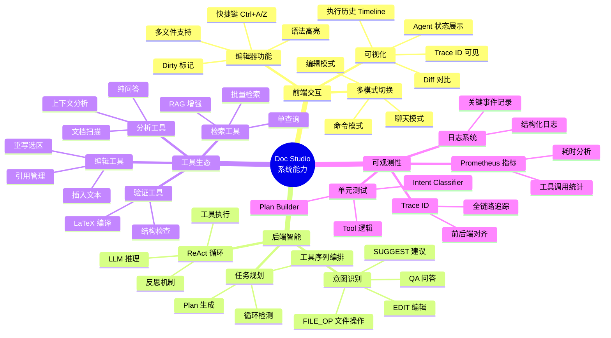
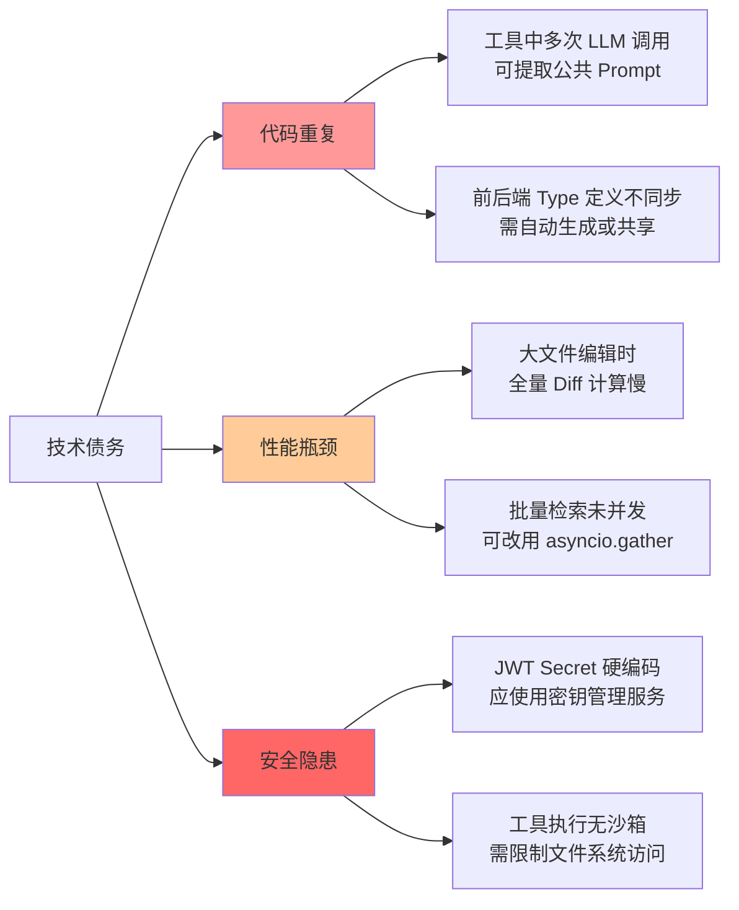

# Doc Studio 架构概览（2025-12 最新版）

本文档记录目前 Doc Studio（后端服务 + 前端编辑器）的整体架构、组件划分以及调试要点，方便后续团队成员快速理解与扩展。

---

## 1. 总体目标

- **智能编辑助手**：支持问答、建议、文档编辑、引用管理、编译检查等场景，尽量接近 Cursor 的体验。
- **知识库增强但非强依赖**：在没有 KB 时仍能完成任务，绑定 KB 时提升质量。
- **工程化可观察**：具备 Trace ID、工具指标、测试覆盖，便于监控与调试。
- **前后端解耦**：前端提供多模式交互（聊天/编辑/命令），后端负责意图识别、计划编排与工具执行。

### 1.1 系统整体架构图



---

## 2. 后端架构

### 2.1 模块和依赖

```
backend/services/doc_studio
├─ main.py                 # FastAPI 应用、CORS、Trace 中间件
├─ router/
│  └─ agent_rt.py          # /api/workspaces/... 主路由 + /api/metrics、/api/knowledge-bases
├─ service/
│  ├─ agent_service.py     # 核心 ReAct 循环 + Plan/Intent 管理
│  ├─ intent_classifier.py # 轻量意图识别 (QA/SUGGEST/EDIT/...)
│  ├─ plan_builder.py      # 根据意图/选区生成工具序列
│  ├─ tool_registry.py     # 注册全部工具
│  └─ tools/               # 工具实现（分析/检索/编辑/验证/响应）
├─ metrics.py              # 工具级 Prometheus 指标
├─ utils/trace.py          # Trace ID 共享
└─ tests/                  # 核心逻辑单元测试
```

#### 后端核心架构（ASCII）

```
┌─────────────────────────────────────────────────────────────────┐
│                    Doc Studio Backend                           │
├─────────────────────────────────────────────────────────────────┤
│                                                                 │
│  ┌──────────────────────────────────────────────────────────┐  │
│  │  1. FastAPI 应用层 (main.py)                              │  │
│  │     • Trace ID 中间件（X-Trace-Id 管理）                  │  │
│  │     • CORS 配置                                           │  │
│  │     • 路由注册                                            │  │
│  └────────────────┬─────────────────────────────────────────┘  │
│                   │                                             │
│  ┌────────────────▼─────────────────────────────────────────┐  │
│  │  2. 路由层 (router/agent_rt.py)                          │  │
│  │     • POST /api/workspaces/{id}/edit                     │  │
│  │       └─> 接收用户指令、选区、KB、模式                    │  │
│  │     • GET /api/metrics                                   │  │
│  │       └─> 导出 Prometheus 指标                           │  │
│  │     • GET /api/knowledge-bases                           │  │
│  │       └─> 代理获取用户知识库列表                          │  │
│  └────────────────┬─────────────────────────────────────────┘  │
│                   │                                             │
│  ┌────────────────▼─────────────────────────────────────────┐  │
│  │  3. Agent 核心服务 (service/agent_service.py)            │  │
│  │                                                           │  │
│  │  ┌─────────────────────────────────────────────────────┐ │  │
│  │  │  3.1 意图识别 (intent_classifier.py)                │ │  │
│  │  │      • classify_intent(prompt, context)            │ │  │
│  │  │      • 返回: QA / SUGGEST / EDIT / FILE_OP / ...   │ │  │
│  │  └──────────────┬──────────────────────────────────────┘ │  │
│  │                 │                                         │  │
│  │  ┌──────────────▼──────────────────────────────────────┐ │  │
│  │  │  3.2 计划构建 (plan_builder.py)                     │ │  │
│  │  │      • build_plan(intent, selection, kb_id)        │ │  │
│  │  │      • 返回: TaskPlan (tool_sequence)              │ │  │
│  │  └──────────────┬──────────────────────────────────────┘ │  │
│  │                 │                                         │  │
│  │  ┌──────────────▼──────────────────────────────────────┐ │  │
│  │  │  3.3 ReAct 循环 (_react_loop)                       │ │  │
│  │  │      • Observation: 构建 Prompt + Context          │ │  │
│  │  │      • Thought: LLM 推理 (llm_client.py)           │ │  │
│  │  │      • Action: 工具调用 (tool_registry.py)         │ │  │
│  │  │      • Reflection: 判断是否达成目标                 │ │  │
│  │  │      • 循环直到 FINISH 或达到最大迭代                │ │  │
│  │  └──────────────┬──────────────────────────────────────┘ │  │
│  │                 │                                         │  │
│  │  ┌──────────────▼──────────────────────────────────────┐ │  │
│  │  │  3.4 工具执行 (tool_registry.py)                    │ │  │
│  │  │      • register_tool() / get_tool()                │ │  │
│  │  │      • 调用具体工具的 execute()                     │ │  │
│  │  │      • 记录执行时间和状态 → metrics.py             │ │  │
│  │  └─────────────────────────────────────────────────────┘ │  │
│  │                                                           │  │
│  └───────────────────────────────────────────────────────────┘  │
│                                                                 │
│  ┌─────────────────────────────────────────────────────────┐   │
│  │  4. 工具层 (service/tools/)                             │   │
│  │                                                          │   │
│  │  • analysis_tools.py   - 分析、答疑                     │   │
│  │  • retrieval_tools.py  - RAG 检索                       │   │
│  │  • editing_tools.py    - 文本插入/重写/引用              │   │
│  │  • validation_tools.py - LaTeX 编译验证                 │   │
│  │  • response_tools.py   - 最终回复用户                   │   │
│  │                                                          │   │
│  └──────────────────────────────────────────────────────────┘   │
│                                                                 │
│  ┌─────────────────────────────────────────────────────────┐   │
│  │  5. 可观测性 (metrics.py + utils/trace.py)              │   │
│  │     • Prometheus 指标: tool_calls_total / duration      │   │
│  │     • Trace ID: 全链路日志追踪                          │   │
│  └─────────────────────────────────────────────────────────┘   │
│                                                                 │
└─────────────────────────────────────────────────────────────────┘
```

### 2.2 请求处理流

1. **Trace 中间件**（`main.py`）：
   - 从 `X-Trace-Id` 获取或生成 Trace ID，注入日志和响应。
2. **路由层**（`router/agent_rt.py`）：
   - `/api/workspaces/{id}/edit`：拉取用户请求，携带 `interaction_mode/command_slug`（来自前端）。
   - `/api/metrics`：导出 Prometheus 格式指标。
3. **Agent 执行层（`agent_service.py`）**：
   - 调用 `classify_intent()` 判断意图，`build_plan()` 生成任务计划。
   - `_react_loop` 执行 ReAct：观察 → LLM 决策 → 工具执行 → 记录 → 反思。
   - 工具执行前后记录耗时、成功/失败，用于指标；若重复调用同一工具或达到迭代上限，记入 `warnings`。
   - 结果中包含 `file_diffs`、`execution_history`、`intent_type`、`plan`、`trace_id`、`warnings`。
4. **工具层**：
   - **分析类**：`AnalyzeContextTool`、`AnalyzeDocumentTool`、`AnswerWithoutEditTool`。
   - **检索类**：`SearchPapersTool`、`BatchSearchPapersTool`（KB 缺失时自动跳过）。
   - **编辑类**：`InsertTextTool`、`RewriteSelectionTool`（按偏移重写选区）、`InsertCitationTool`、`UpdateBibliographyTool`。
   - **验证类**：`CompileLatexTool` ... 等。
   - **响应类**：`ReplyToUserTool` 负责最终答复。

#### ReAct 循环流程图



### 2.3 工具分类与能力图



### 2.4 可观察与测试

- `metrics.py`：累计 `doc_studio_tool_calls_total` 与 `doc_studio_tool_duration_seconds_total`。
- Trace ID：所有业务日志均带 `trace_id`，前端请求/响应也保持。
- `tests/`：目前包含 `intent_classifier`、`plan_builder`、`rewrite_selection_tool` 的基础测试，可在容器内 `pytest` 执行。

#### Trace ID 全链路流转图



---

## 3. 前端架构（`frontend/src/pages/doc-studio`）

### 3.1 核心组件

- **LatexEditorPage**：
  - 左侧：工作区 / 知识库选择、文件操作。
  - 中间：Monaco 编辑器，支持多文件、多光标操作。
  - 右侧 Tabs：
    - `Agent 聊天`：聊天框 + 模式/命令切换 + Agent 状态（意图、计划、Trace、警告）。
    - `执行历史`：Timeline 显示每一步的类型、工具、时间、摘要。
    - `编译结果`：展示最新编译状态、日志。
  - Diff Modal：文件列表、并排/逐行切换、逐文件接受/拒绝。
  - 命令面板（Modal）：可搜索/套用预设命令模板（优化摘要、润色等）。

#### 前端组件布局图

```
┌────────────────────────────────────────────────────────────────────┐
│                    LaTeX Editor Page                               │
├────────┬───────────────────────────────────────┬───────────────────┤
│        │                                       │                   │
│ 左侧栏  │           中间编辑区                   │      右侧面板      │
│        │                                       │                   │
│ ┌────┐ │ ┌───────────────────────────────────┐ │ ┌───────────────┐ │
│ │工作│ │ │                                   │ │ │  Tabs:        │ │
│ │区  │ │ │      Monaco Editor                │ │ │               │ │
│ │选择│ │ │                                   │ │ │ • Agent 聊天   │ │
│ └────┘ │ │   - 多文件支持                     │ │ │ • 执行历史     │ │
│        │ │   - 语法高亮                       │ │ │ • 编译结果     │ │
│ ┌────┐ │ │   - Ctrl+A/Z                      │ │ │               │ │
│ │知识│ │ │   - Dirty 标记                    │ │ │               │ │
│ │库  │ │ │                                   │ │ │               │ │
│ │选择│ │ │                                   │ │ │               │ │
│ └────┘ │ │                                   │ │ │               │ │
│        │ └───────────────────────────────────┘ │ │               │ │
│ ┌────┐ │                                       │ │               │ │
│ │文件│ │ ┌───────────────────────────────────┐ │ │               │ │
│ │树  │ │ │  编译 | 预览 PDF | 下载            │ │ │               │ │
│ │    │ │ └───────────────────────────────────┘ │ │               │ │
│ │    │ │                                       │ │               │ │
│ └────┘ │                                       │ └───────────────┘ │
│        │                                       │                   │
└────────┴───────────────────────────────────────┴───────────────────┘
         │                                       │
         └───────────────┬───────────────────────┘
                         │
         ┌───────────────▼───────────────────────┐
         │        全局弹窗 (Modals)               │
         │                                       │
         │  • Diff Modal (文件对比/接受/拒绝)      │
         │  • 命令面板 (Command Palette)          │
         └───────────────────────────────────────┘
```

#### 前端交互模式流程图



### 3.2 关键状态管理（valtio）

- `docStudioState`：
  - `chatMessages`、`executionHistory`、`agentStatus(intentType/plan/warnings/traceId)`。
  - 每次发送指令会生成 `traceId`，在消息 meta 与 UI 中展示。
- 与后端请求：
  - `runAgentTask()` 接收 `interaction_mode`、`command_slug`、`selection`、`traceId`。
  - 响应解构 `file_diffs`、`plan`、`intent_type` 等用于 UI 展示。

#### 前端状态管理架构



### 3.3 交互流程

1. 用户在聊天输入或命令面板选择模板 → 发送。
2. 前端生成 Trace ID、拼装 context/options → 调用 `/api/workspaces/{id}/edit`。
3. 后端返回 `execution_history + plan + warnings + trace_id` → UI 渲染状态条/Tabs/Timeline。
4. 若返回 `file_diffs` → 打开 Diff Modal 供用户逐文件审查并应用。

---

## 4. 调试与排错指南

### 4.1 Trace ID 调试流程



### 4.2 常见问题速查表

1. **Trace 对齐**
   - 浏览器请求头 / 响应头：`X-Trace-Id`。
   - 后端日志：`[trace_id=<...>]` 便于定位该请求对应的工具调用。
   - 前端聊天 UI 也会显示 Trace ID。

2. **指标查看**
   - 打开 `http://<agent_host>:8003/api/metrics`，可查看 Prometheus 文本。
   - 关注 `doc_studio_tool_calls_total{tool=...,status=...}` 和耗时指标。

3. **常见问题**
   - **工具重复调用 → 告警**：聊天面板会显示 warning（如"检测到 insert_text_tool 重复调用"），同时在日志中可找到 `task plan` 状态。
   - **知识库缺失**：检索工具会自动跳过并在 plan/警告中提示，Agent 仍会基于上下文继续执行。
   - **Diff Modal 无改动**：检查 `file_diffs` 是否为空；若 Agent 只给建议而未修改，正常不会打开 Diff。

4. **测试命令**
   - 后端：`cd backend/services/doc_studio && pytest`
   - 前端：`npm run lint` / `npm run dev`，实际交互用浏览器验证。

### 4.3 日志级别与关键字

| 日志级别 | 关键字 | 含义 |
|---------|--------|------|
| `[INFO]` | `Edit request` | 接收到新的编辑请求 |
| `[INFO]` | `Intent classified` | 意图识别完成 |
| `[INFO]` | `Task plan built` | 任务计划生成完成 |
| `[INFO]` | `Tool execution` | 工具执行开始 |
| `[INFO]` | `Tool result` | 工具执行结果 |
| `[WARNING]` | `Tool loop detected` | 检测到工具循环调用 |
| `[ERROR]` | `Error calling LLM` | LLM API 调用失败 |
| `[ERROR]` | `Tool execution failed` | 工具执行失败 |

---

## 5. 系统能力矩阵

### 5.1 当前已实现功能



### 5.2 后续扩展建议

| 类别 | 当前状态 | 未来扩展 | 优先级 |
|------|---------|---------|-------|
| **系统优化** | 多处逻辑不完善 | 10 大模块完整升级（详见 `COMPREHENSIVE_UPGRADE_PLAN.md`） | 🔴 极高 |
| **意图识别** | 规则版（关键词匹配） | 轻量模型（微调 BERT/小型 LLM） | 🟡 中 |
| **指标系统** | 工具级基础指标 | LLM/RAG 耗时、编译成功率、用户满意度 | 🟡 中 |
| **测试覆盖** | 核心逻辑单元测试 | E2E 自动化（mock LLM + Playwright） | 🟡 中 |
| **多租户** | 单用户模式 | 工作区级别权限、协作编辑 | 🟢 低 |
| **RL 训练** | 设计文档已完成 | 实际数据收集、模型微调 | 🟢 低 |

### 5.3 技术债务与优化方向



---

## 6. 参考文档

- **完整优化升级方案**：`COMPREHENSIVE_UPGRADE_PLAN.md` - 10 大模块全面升级计划（🆕 **必读，直接按此实施**）
  - 交互逻辑重构（自然语言 vs 预设命令）
  - 意图识别升级（多维度打分 + 否定检测 + 置信度）
  - 计划构建升级（动态条件评估引擎）
  - 错误处理与降级（装饰器 + Pydantic 校验）
  - 可观测性增强（Prometheus + Grafana + 用户反馈）
  - 安全防护（Prompt Injection + 速率限制）
  - 性能优化（增量 Diff + 并发检索 + LLM 缓存）
  - 测试覆盖（单元 + 集成测试）
  - 代码质量提升
  - 用户体验优化
- **实现计划**：`IMPLEMENTATION_PLAN.md` - 四阶段开发路线图
- **RL 训练设计**：`RL_TRAINING_DESIGN.md` - 强化学习与奖励函数设计
- **模型架构**：`MODEL_ARCHITECTURE.md` - Planner/Executor/Reflector 详解
- **原始设计**：`LaTeX编辑Agent设计.md` - 初始需求与技术选型

---

**文档维护说明**：
- 本文档为 **2025-12-07** 快照，记录当前最新架构。
- 若业务逻辑、工具新增、或架构调整，请及时更新本文件对应章节。
- 建议每个 Sprint/里程碑后同步更新 Mermaid 图和能力矩阵。

**联系方式**：
- 后端问题：检查 `backend/services/doc_studio/` 目录
- 前端问题：检查 `frontend/src/pages/doc-studio/` 目录
- 日志查看：`make logs-agent --tail=0 -f`
- 指标查看：`http://localhost:8003/api/metrics`

---

*如需更深入了解某个模块，可直接查阅源码并配合本文档中的流程图进行理解。*

