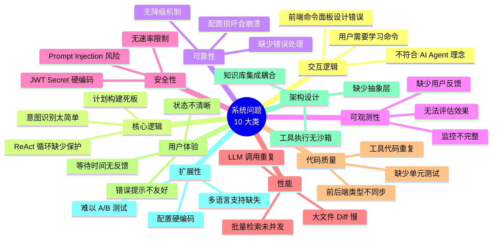
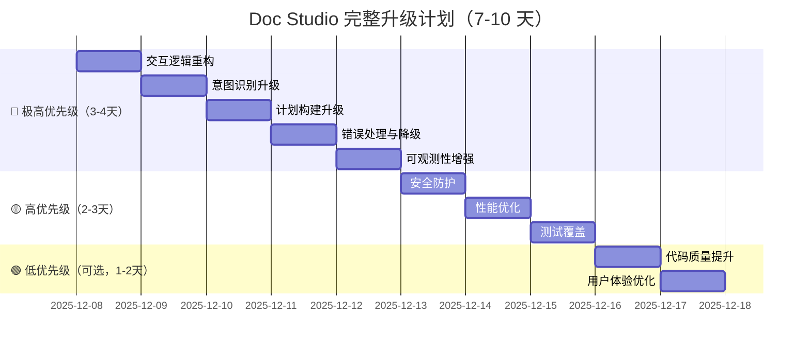

# Doc Studio 完整优化升级方案

> **目标**：将当前系统全面升级为生产级、成熟的 AI Agent 系统，适合求职面试展示
>
> **说明（2026-02-07）**：本文档包含历史规划与示例代码，实际实现以仓库代码为准。
> v2 核心功能已落地，表中“部分完成/可选增强”仅代表可迭代项，不影响当前闭环使用。

## 📊 当前系统问题全面审查

### 问题分类



---

## ⏱ 实施状态速览（2026-02-07 以代码为准）

| 模块 | 状态 | 备注 |
|------|------|------|
| 1. 交互逻辑重构 | ✅ 已完成 | 前端已改为自然语言输入 + 快捷示例 |
| 2. 意图识别升级 | ✅ 已完成 | RobustIntentClassifier 已上线并输出置信度 |
| 3. 计划构建升级 | ✅ 已完成 | DynamicPlanBuilder + 配置驱动策略已生效 |
| 4. 错误处理与降级 | 🟡 可选增强 | 基础降级已具备，配置/工具级 fallback 可继续完善 |
| 5. 可观测性增强 | ✅ 已完成 | Prometheus 指标齐全 + 用户反馈闭环已实现（前端点赞/点踩 + 后端 API），Grafana Dashboard 待补 |
| 6. 安全防护 | ✅ 已完成 | Prompt Injection/速率限制/ENV 管理已落地 |
| 7. 性能优化 | ✅ 已完成 | 工作区缓存 + 增量 Diff 已实现（大文件截断展示），LLM Cache 待补 |
| 8. 测试覆盖 | 🟡 可选增强 | 意图/计划等单测已写，集成测试可继续完善 |
| 9. 代码质量提升 | 🟡 可选增强 | BaseLLMTool/类型同步为工程化增强项 |
|10. 用户体验优化 | 🟡 可选增强 | 状态/警告展示 OK，细节体验可继续完善 |

> **可选增强项**（不影响 v2 核心交付，建议优先级从高到低）  
> 1. **Grafana Dashboard 配置**（模块 5）—— 可视化展示意图识别准确率、置信度分布、用户反馈统计。  
> 2. **端到端集成测试**（模块 8）—— 证明系统稳定度，亦是招聘方关注点。  
> 3. **LLM 调用缓存**（模块 7，可选）—— 减少重复调用，提升性能。  
> 其余（模块 9、部分 UX 优化）可视为后续增强，不必强行落地。

---

## 🎯 完整优化方案（10 大模块）

### 模块 1：交互逻辑重构 🔴 极高优先级 — ✅ 已完成

#### 问题

**当前设计（错误）**：
```typescript
// 前端：用户点击命令面板 → 选择预设命令
<Modal title="命令面板">
  <List dataSource={commandTemplates}>
    <Item>优化摘要</Item>
    <Item>润色段落</Item>
  </List>
</Modal>
```

**问题**：
- ❌ 用户需要学习有哪些命令
- ❌ 不够灵活，只能做预设操作
- ❌ 不符合 AI Agent 的核心理念（自然语言理解）

#### 解决方案

**新设计（Cursor 方式）**：
```typescript
// 前端：用户直接输入自然语言
<Input.TextArea
  placeholder="直接描述你的需求，例如：'帮我优化这段摘要'、'什么是图神经网络？'"
  value={prompt}
  onChange={(e) => setPrompt(e.target.value)}
/>

// 可选：快捷示例（不是必须的）
<Space>
  <Tag onClick={() => setPrompt("帮我优化摘要")}>示例：优化摘要</Tag>
  <Tag onClick={() => setPrompt("检查语法")}>示例：检查语法</Tag>
</Space>
```

**实施步骤**：
1. 移除或弱化命令面板（保留作为快捷输入，但不是主要交互）
2. 强调自然语言输入框
3. 添加使用提示和示例
4. 更新用户引导文案

**预计时间**：0.5 天

---

### 模块 2：意图识别升级 🔴 极高优先级 — ✅ 已完成

#### 问题

**当前实现（简单关键词匹配）**：
```python
# backend/services/doc_studio/service/intent_classifier.py
def classify_intent(user_input: str, context: dict = None) -> str:
    if "优化" in user_input:
        return "EDIT"
    if "什么" in user_input:
        return "QA"
    # ...
```

**漏洞**：
- ❌ "帮我检查一下**修改**是否正确" → 误判为 EDIT（因为有"修改"），实际应该是 SUGGEST
- ❌ "什么是**优化**算法？" → 误判为 EDIT，实际应该是 QA
- ❌ "**不要修改**" → 误判为 EDIT
- ❌ 无置信度输出，无法评估质量

#### 解决方案

**新实现（多维度打分 + 否定检测）**：

```python
# backend/services/doc_studio/service/intent_classifier_v2.py

from typing import Tuple
import re

class RobustIntentClassifier:
    """鲁棒的意图识别器"""
    
    def __init__(self):
        self.config = config_loader.load_intent_rules()
        self.negation_words = ["不要", "不用", "无需", "别", "不", "没必要"]
    
    def _contains_negation(self, text: str, keyword: str) -> bool:
        """检查关键词前是否有否定词"""
        kw_pos = text.find(keyword)
        if kw_pos == -1:
            return False
        prefix = text[max(0, kw_pos - 5):kw_pos]
        return any(neg in prefix for neg in self.negation_words)
    
    def _score_intent(self, user_input: str, rule: dict) -> float:
        """
        多维度打分
        
        维度：
        1. 关键词匹配（带否定检测）
        2. 正则模式匹配
        3. 上下文加权（问号、选区等）
        4. 句式分析（"帮我XX"、"请XX"）
        
        Returns:
            0-1 分数，越高越匹配
        """
        score = 0.0
        intent = rule["intent"]
        
        # 1. 关键词匹配（带否定检测）
        keywords = rule.get("keywords", [])
        keyword_matches = 0
        for kw in keywords:
            if kw in user_input:
                if self._contains_negation(user_input, kw):
                    score -= 0.2  # 有否定词，减分
                else:
                    keyword_matches += 1
        
        if keyword_matches > 0:
            score += 0.4 * min(keyword_matches / 3, 1.0)
        
        # 2. 正则模式匹配
        patterns = rule.get("patterns", [])
        pattern_matches = sum(1 for p in patterns if re.search(p, user_input))
        if pattern_matches > 0:
            score += 0.3 * min(pattern_matches / 2, 1.0)
        
        # 3. 上下文加权
        if intent == "QA" and user_input.endswith("?"):
            score += 0.2
        if intent == "QA" and any(q in user_input for q in ["什么", "为什么", "怎么"]):
            score += 0.15
        
        # 4. 句式分析
        if intent == "EDIT" and re.match(r"^(帮我|请|麻烦).*", user_input):
            score += 0.15
        
        return min(score, 1.0)
    
    def classify(self, user_input: str, context: dict = None) -> Tuple[str, float]:
        """
        识别意图并返回置信度
        
        Returns:
            (intent_type, confidence)
        """
        self.config = config_loader.load_intent_rules()
        rules = self.config.get("rules", [])
        
        # 计算每个意图的得分
        scores = {rule["intent"]: self._score_intent(user_input, rule) for rule in rules}
        
        # 找到最高分意图
        best_intent = max(scores, key=scores.get)
        confidence = scores[best_intent]
        
        # 如果置信度太低，返回 fallback
        if confidence < 0.3:
            fallback = self.config.get("fallback", {})
            return fallback.get("intent", "EDIT"), confidence
        
        return best_intent, confidence
```

**配置文件**：
```json
// backend/services/doc_studio/configs/intent_rules.json
{
  "version": "2.0",
  "rules": [
    {
      "intent": "QA",
      "description": "用户询问问题",
      "keywords": ["什么是", "为什么", "怎么", "如何", "解释"],
      "patterns": [".*什么.*", ".*为什么.*", ".*\\?$"],
      "examples": ["什么是图神经网络？", "为什么要用强化学习？"]
    },
    {
      "intent": "SUGGEST",
      "description": "用户希望得到建议",
      "keywords": ["检查", "有没有问题", "建议", "看看", "分析"],
      "patterns": [".*检查.*", ".*有.*问题.*"],
      "examples": ["帮我检查一下摘要", "这里有什么问题吗？"]
    },
    {
      "intent": "EDIT",
      "description": "用户明确要求修改",
      "keywords": ["优化", "改进", "修改", "润色", "重写"],
      "patterns": [".*优化.*", ".*修改.*"],
      "examples": ["帮我优化这段摘要", "修改这段代码"]
    }
  ],
  "fallback": {
    "intent": "EDIT",
    "reason": "默认假设用户希望进行编辑"
  }
}
```

**集成到 AgentService**：
```python
# backend/services/doc_studio/service/agent_service.py

from service.intent_classifier_v2 import RobustIntentClassifier
from observability import AgentObservability

class LaTeXEditAgent:
    async def execute(self, user_intent: str, ...):
        # 意图识别（带置信度）
        classifier = RobustIntentClassifier()
        intent, confidence = classifier.classify(user_intent, context)
        
        # 记录到监控系统
        AgentObservability.record_intent_classification(intent, confidence)
        
        # 低置信度告警
        if confidence < 0.5:
            self.warnings.append(
                f"意图识别置信度较低 ({confidence:.2f})，可能理解有误"
            )
        
        # 继续执行...
```

**预计时间**：1 天

---

### 模块 3：计划构建升级 🔴 极高优先级 — ✅ 已完成

#### 问题

**当前实现（固定工具序列）**：
```python
# backend/services/doc_studio/service/plan_builder.py
def build_plan(intent: str, context: dict = None) -> List[str]:
    if intent == "EDIT":
        return [
            "analyze_document_tool",  # 总是执行，即使不需要
            "search_papers_tool",     # 总是执行，即使没有 KB
            "rewrite_selection_tool",
            "reply_to_user_tool"
        ]
```

**问题**：
- ❌ 所有 EDIT 场景用同样的工具链，不够灵活
- ❌ 配置的 `optional` 和 `condition` 没有真正实现
- ❌ 无法根据实际情况（选区长度、是否有 KB）动态调整

#### 解决方案

**新实现（动态条件评估）**：

```python
# backend/services/doc_studio/service/plan_builder_v2.py

class DynamicPlanBuilder:
    """动态计划构建器"""
    
    def _eval_condition(self, condition: str, context: Dict[str, Any]) -> bool:
        """
        评估条件表达式
        
        支持：
        - "has_selection": 是否有选区
        - "has_kb": 是否绑定知识库
        - "selection_length > 100": 选区长度大于 100
        - "file_count > 1": 文件数量大于 1
        """
        if not condition:
            return True
        
        # has_selection
        if "has_selection" in condition:
            return bool(context.get("selection"))
        
        # has_kb
        if "has_kb" in condition:
            return bool(context.get("kb_id"))
        
        # selection_length > 100
        if "selection_length" in condition:
            match = re.search(r"selection_length\s*([<>=]+)\s*(\d+)", condition)
            if match:
                op, threshold = match.groups()
                length = len(context.get("selection", ""))
                if op == ">":
                    return length > int(threshold)
                elif op == "<":
                    return length < int(threshold)
        
        # file_count > 1
        if "file_count" in condition:
            match = re.search(r"file_count\s*([<>=]+)\s*(\d+)", condition)
            if match:
                op, threshold = match.groups()
                file_count = len(context.get("files", []))
                if op == ">":
                    return file_count > int(threshold)
        
        return True
    
    def build_plan(
        self, 
        intent: str, 
        context: Dict[str, Any] = None,
        confidence: float = 1.0
    ) -> Dict[str, Any]:
        """
        构建动态计划
        
        Returns:
            {
                "tools": ["tool1", "tool2"],
                "notes": ["why tool1", "why tool2"],
                "max_iterations": 10
            }
        """
        context = context or {}
        self.config = config_loader.load_plan_strategy()
        strategies = self.config.get("strategies", {})
        
        if intent not in strategies:
            return {
                "tools": ["answer_without_edit_tool"],
                "notes": ["Fallback: 使用默认问答工具"],
                "max_iterations": 3
            }
        
        strategy = strategies[intent]
        tool_sequence = strategy.get("tool_sequence", [])
        
        selected_tools = []
        notes = []
        
        for tool_config in tool_sequence:
            tool_name = tool_config["tool"]
            is_optional = tool_config.get("optional", False)
            condition = tool_config.get("condition", "")
            
            # 评估条件
            if condition and not self._eval_condition(condition, context):
                notes.append(f"跳过 {tool_name}: 条件不满足 ({condition})")
                continue
            
            # 必选 OR (可选 + 条件满足)
            if not is_optional or self._eval_condition(condition, context):
                selected_tools.append(tool_name)
                notes.append(f"选择 {tool_name}: {condition if condition else '必选'}")
        
        # 低置信度，先分析上下文
        if confidence < 0.5:
            selected_tools.insert(0, "analyze_context_tool")
            notes.insert(0, f"置信度较低 ({confidence:.2f})，先分析")
        
        return {
            "tools": selected_tools,
            "notes": notes,
            "max_iterations": strategy.get("max_iterations", 10),
            "intent": intent,
            "confidence": confidence
        }
```

**配置文件**：
```json
// backend/services/doc_studio/configs/plan_strategy.json
{
  "version": "2.0",
  "strategies": {
    "EDIT": {
      "description": "编辑场景",
      "tool_sequence": [
        {
          "tool": "analyze_document_tool",
          "optional": true,
          "condition": "selection_length > 200"
        },
        {
          "tool": "search_papers_tool",
          "optional": true,
          "condition": "has_kb"
        },
        {
          "tool": "rewrite_selection_tool",
          "required": false,
          "condition": "has_selection"
        },
        {
          "tool": "insert_text_tool",
          "required": false,
          "condition": "!has_selection"
        },
        {
          "tool": "reply_to_user_tool",
          "required": true
        }
      ],
      "max_iterations": 10
    },
    "QA": {
      "description": "问答场景",
      "tool_sequence": [
        {
          "tool": "search_papers_tool",
          "optional": true,
          "condition": "has_kb"
        },
        {
          "tool": "answer_without_edit_tool",
          "required": true
        }
      ],
      "max_iterations": 3
    }
  }
}
```

**预计时间**：1 天

---

### 模块 4：错误处理与降级 🔴 高优先级 — 🟡 部分完成

> 当前进度：LLM 推理已接入 async_error_guard 降级、配置文件由 Pydantic 校验。  
> 待办（可选增强）：  
> - ConfigLoader 失败时加载默认模板而非空 dict。  
> - 常用工具（文件 I/O、RAG 调用）补充兜底策略/重试逻辑。  
> - 统一错误码/用户提示映射。

#### 问题

- ❌ 配置文件损坏 → 程序崩溃
- ❌ LLM API 超时 → 用户长时间等待
- ❌ 工具执行失败 → 没有 fallback

#### 解决方案

**装饰器模式实现降级**：

```python
# backend/services/doc_studio/service/error_handler.py

import logging
from typing import Any, Callable, Optional
from functools import wraps

logger = logging.getLogger(__name__)

class AgentErrorHandler:
    """错误处理和降级机制"""
    
    @staticmethod
    def with_fallback(
        fallback_value: Any = None,
        fallback_fn: Optional[Callable] = None,
        error_types: tuple = (Exception,)
    ):
        """
        装饰器：为函数添加降级机制
        """
        def decorator(func):
            @wraps(func)
            async def wrapper(*args, **kwargs):
                try:
                    return await func(*args, **kwargs)
                except error_types as e:
                    logger.error(
                        f"Function {func.__name__} failed: {e}",
                        exc_info=True
                    )
                    
                    if fallback_fn:
                        logger.info(f"Falling back to {fallback_fn.__name__}")
                        return await fallback_fn(*args, **kwargs)
                    
                    logger.info(f"Returning fallback value: {fallback_value}")
                    return fallback_value
            return wrapper
        return decorator
```

**Pydantic 配置校验**：

```python
# backend/services/doc_studio/core/config_validator.py

from pydantic import BaseModel, validator
from typing import List, Dict, Literal

class IntentRule(BaseModel):
    intent: Literal["QA", "SUGGEST", "EDIT", "FILE_OP"]
    description: str
    keywords: List[str]
    patterns: List[str] = []
    
    @validator('keywords')
    def validate_keywords(cls, v):
        if len(v) == 0:
            raise ValueError("至少需要一个关键词")
        return v

class IntentRulesConfig(BaseModel):
    version: str
    rules: List[IntentRule]
    fallback: Dict[str, str]

def validate_intent_rules(config_data: dict) -> IntentRulesConfig:
    try:
        return IntentRulesConfig(**config_data)
    except Exception as e:
        raise ValueError(f"Invalid config: {e}")
```

**应用到系统**：

```python
# ConfigLoader 中使用
class ConfigLoader:
    @AgentErrorHandler.with_fallback(fallback_value={})
    def _load_config(self, filename: str) -> Dict[str, Any]:
        file_path = self.config_dir / filename
        with open(file_path, 'r') as f:
            config = json.load(f)
        # 校验配置
        if filename == "intent_rules.json":
            validate_intent_rules(config)
        return config

# AgentService 中使用
class LaTeXEditAgent:
    async def _llm_fallback(self, *args, **kwargs):
        """LLM 失败时的降级"""
        return ToolAction(
            tool_name="reply_to_user_tool",
            parameters={"message": "抱歉，AI 服务暂时不可用"}
        )
    
    @AgentErrorHandler.with_fallback(
        fallback_fn=_llm_fallback,
        error_types=(TimeoutError, ConnectionError)
    )
    async def _llm_reason_and_act(self, observation: str) -> ToolAction:
        # 原有实现
        pass
```

**预计时间**：0.5 天

---

### 模块 5：可观测性增强 🔴 高优先级 — ✅ 已完成

> 当前进度：Prometheus 暴露意图/计划/工具/工作区缓存指标 + **用户反馈闭环已实现**（前端点赞/点踩按钮 + 后端 `/feedback` API + `record_user_feedback` 指标）。  
> 待办（可选增强）：  
> - Grafana Dashboard 配置（可视化展示意图识别准确率、置信度分布、用户反馈统计）。  
> - TraceID 关联与失败对话告警规则。

#### 问题

- ❌ 不知道意图识别准确率
- ❌ 不知道哪个工具最慢
- ❌ 无法追踪用户满意度

#### 解决方案

**完整的 Prometheus 指标**：

```python
# backend/services/doc_studio/observability.py

from prometheus_client import Counter, Histogram
import time

# 意图识别指标
intent_classification_total = Counter(
    'agent_intent_classification_total',
    'Total intent classifications',
    ['intent', 'confidence_bucket']  # 置信度分桶：low/medium/high
)

intent_classification_confidence = Histogram(
    'agent_intent_classification_confidence',
    'Intent confidence distribution',
    buckets=[0.2, 0.4, 0.6, 0.8, 1.0]
)

# 计划构建指标
plan_build_duration = Histogram(
    'agent_plan_build_duration_seconds',
    'Plan build time',
    buckets=[0.01, 0.05, 0.1, 0.2, 0.5]
)

plan_tool_count = Histogram(
    'agent_plan_tool_count',
    'Tools in plan',
    ['intent'],
    buckets=[1, 2, 3, 5, 10]
)

# 用户反馈
user_feedback_total = Counter(
    'agent_user_feedback_total',
    'User feedback',
    ['rating']  # thumbs_up / thumbs_down
)

class AgentObservability:
    @staticmethod
    def record_intent_classification(intent: str, confidence: float):
        # 置信度分桶
        bucket = 'low' if confidence < 0.5 else ('medium' if confidence < 0.8 else 'high')
        intent_classification_total.labels(intent=intent, confidence_bucket=bucket).inc()
        intent_classification_confidence.observe(confidence)
    
    @staticmethod
    def record_plan_build(intent: str, tool_count: int, duration: float):
        plan_build_duration.observe(duration)
        plan_tool_count.labels(intent=intent).observe(tool_count)
    
    @staticmethod
    def record_user_feedback(rating: str, trace_id: str):
        user_feedback_total.labels(rating=rating).inc()
```

**前端用户反馈收集**：

```typescript
// frontend/src/pages/doc-studio/index.tsx

<div className="agent-message-feedback">
  <Tooltip title="这个回答有帮助">
    <Button
      size="small"
      icon={<LikeOutlined />}
      onClick={() => handleFeedback(message.meta.traceId, 'thumbs_up')}
    />
  </Tooltip>
  <Tooltip title="这个回答没帮助">
    <Button
      size="small"
      icon={<DislikeOutlined />}
      onClick={() => handleFeedback(message.meta.traceId, 'thumbs_down')}
    />
  </Tooltip>
</div>
```

**Grafana 仪表盘**：

```yaml
# grafana/dashboards/agent_dashboard.json
panels:
  - title: "意图识别准确率（基于用户反馈）"
    expr: |
      rate(agent_user_feedback_total{rating="thumbs_up"}[5m]) /
      rate(agent_user_feedback_total[5m])
  
  - title: "意图识别置信度分布"
    expr: agent_intent_classification_confidence
  
  - title: "Top 10 慢工具"
    expr: topk(10, avg(doc_studio_tool_duration_seconds_total) by (tool))
```

**预计时间**：1 天

---

### 模块 6：安全防护 🟡 中优先级 — ✅ 已完成

#### 问题

- ❌ Prompt Injection：用户可以输入"忽略之前的指令"
- ❌ 无输入长度限制
- ❌ 无速率限制
- ❌ JWT Secret 硬编码

#### 解决方案

**输入清洗**：

```python
# backend/services/doc_studio/security.py

class InputSanitizer:
    """输入清洗和验证"""
    
    INJECTION_PATTERNS = [
        r"忽略.*之前.*指令",
        r"ignore.*previous.*instructions?",
        r"system\s*:\s*",
        r"<\|im_start\|>",
    ]
    
    SENSITIVE_WORDS = ["删除数据库", "rm -rf", "drop table"]
    MAX_INPUT_LENGTH = 2000
    
    @classmethod
    def sanitize(cls, user_input: str) -> Tuple[str, Optional[str]]:
        # 长度检查
        if len(user_input) > cls.MAX_INPUT_LENGTH:
            return (
                user_input[:cls.MAX_INPUT_LENGTH],
                f"输入已截断至 {cls.MAX_INPUT_LENGTH} 字符"
            )
        
        # Prompt Injection 检测
        for pattern in cls.INJECTION_PATTERNS:
            if re.search(pattern, user_input, re.IGNORECASE):
                logger.warning(f"Potential injection: {pattern}")
                return ("", "检测到不安全输入，请重新描述")
        
        # 敏感词过滤
        for word in cls.SENSITIVE_WORDS:
            if word in user_input:
                user_input = user_input.replace(word, "***")
        
        # HTML/JS 标签移除
        cleaned = re.sub(r'<[^>]+>', '', user_input)
        
        return cleaned, None
```

**速率限制**：

```python
# backend/services/doc_studio/rate_limiter.py

from fastapi import HTTPException
from datetime import datetime, timedelta
from collections import defaultdict

class RateLimiter:
    def __init__(self, rpm=10, rph=100):
        self.rpm_limit = rpm
        self.rph_limit = rph
        self._requests = defaultdict(list)
    
    def check_rate_limit(self, user_id: str):
        now = datetime.now()
        user_requests = self._requests[user_id]
        
        # 清理过期记录
        cutoff = now - timedelta(hours=1)
        user_requests = [t for t in user_requests if t > cutoff]
        self._requests[user_id] = user_requests
        
        # 每分钟限制
        minute_ago = now - timedelta(minutes=1)
        recent = [t for t in user_requests if t > minute_ago]
        if len(recent) >= self.rpm_limit:
            raise HTTPException(
                status_code=429,
                detail=f"请求过于频繁，请 {60 - (now - recent[0]).seconds} 秒后再试"
            )
        
        # 每小时限制
        if len(user_requests) >= self.rph_limit:
            raise HTTPException(
                status_code=429,
                detail="已达到每小时请求上限"
            )
        
        self._requests[user_id].append(now)

# 在路由中使用
rate_limiter = RateLimiter()

@router.post("/workspaces/{workspace_id}/edit")
async def edit_latex(user_id: str = Header(alias="X-User-Id"), ...):
    rate_limiter.check_rate_limit(user_id)
    # 继续处理
```

**JWT Secret 管理**：

```python
# backend/services/doc_studio/core/config.py

from pydantic import BaseSettings, Field

class Settings(BaseSettings):
    # 从环境变量或密钥管理服务读取
    JWT_SECRET_KEY: str = Field(..., env="JWT_SECRET_KEY")
    
    class Config:
        env_file = ".env"
        env_file_encoding = "utf-8"

settings = Settings()
```

**预计时间**：1 天

---

### 模块 7：性能优化 🟡 中优先级 — ✅ 已完成

> 当前进度：WorkspaceContextCache + cache/scan 指标已上线，RAG 批量检索异步化 + **增量 Diff 已实现**（`diff_generator.py` + 前端 `is_truncated` 标签展示）。  
> 待办（可选增强）：  
> - LLM 响应缓存或重复调用合并。  
> - Compile / Agent 帧的共用结果缓存。

#### 问题

1. **大文件 Diff 计算慢**：全量对比耗时
2. **批量检索未并发**：串行调用 RAG API
3. **LLM 调用重复**：多个工具重复调用 LLM

#### 解决方案

**增量 Diff 计算**：

```python
# backend/services/doc_studio/service/diff_generator.py

import difflib

class IncrementalDiffGenerator:
    """增量 Diff 生成器"""
    
    @staticmethod
    def generate_diff(original: str, modified: str, max_size: int = 10000) -> str:
        """
        生成 Diff，支持大文件优化
        
        对于大文件（>10KB），只生成变更区域的 Diff
        """
        if len(original) < max_size and len(modified) < max_size:
            # 小文件，全量 Diff
            return '\n'.join(difflib.unified_diff(
                original.splitlines(),
                modified.splitlines(),
                lineterm=''
            ))
        
        # 大文件，增量 Diff
        # 1. 找到变更区域
        differ = difflib.SequenceMatcher(None, original, modified)
        opcodes = differ.get_opcodes()
        
        # 2. 只生成变更区域 ±10 行的 Diff
        diff_lines = []
        for tag, i1, i2, j1, j2 in opcodes:
            if tag != 'equal':
                context_start = max(0, i1 - 10)
                context_end = min(len(original), i2 + 10)
                diff_lines.append(f"@@ {context_start}-{context_end} @@")
                diff_lines.extend(original[context_start:context_end].splitlines())
        
        return '\n'.join(diff_lines)
```

**并发 RAG 检索**：

```python
# backend/services/doc_studio/service/tools/retrieval_tools.py

import asyncio

class BatchSearchPapersTool(BaseTool):
    async def execute(self, agent_state: AgentState, parameters: dict) -> ToolResult:
        queries = parameters.get("queries", [])
        
        # ❌ 原来：串行调用
        # results = []
        # for query in queries:
        #     result = await self._search_single(query)
        #     results.append(result)
        
        # ✅ 现在：并发调用
        tasks = [self._search_single(query) for query in queries]
        results = await asyncio.gather(*tasks, return_exceptions=True)
        
        # 处理异常
        valid_results = []
        for i, result in enumerate(results):
            if isinstance(result, Exception):
                logger.error(f"Query {queries[i]} failed: {result}")
            else:
                valid_results.append(result)
        
        return ToolResult(success=True, data=valid_results)
```

**LLM 调用缓存**：

```python
# backend/services/doc_studio/service/llm_cache.py

from functools import lru_cache
import hashlib

class LLMCache:
    """LLM 调用缓存"""
    
    def __init__(self, maxsize=100):
        self._cache = {}
        self._maxsize = maxsize
    
    def _hash_key(self, prompt: str, model: str) -> str:
        """生成缓存 key"""
        content = f"{model}:{prompt}"
        return hashlib.md5(content.encode()).hexdigest()
    
    def get(self, prompt: str, model: str) -> Optional[str]:
        """获取缓存"""
        key = self._hash_key(prompt, model)
        return self._cache.get(key)
    
    def set(self, prompt: str, model: str, response: str):
        """设置缓存"""
        key = self._hash_key(prompt, model)
        if len(self._cache) >= self._maxsize:
            # 移除最早的缓存（简单 FIFO）
            self._cache.pop(next(iter(self._cache)))
        self._cache[key] = response

# 在 LLMClient 中使用
class LLMClient:
    def __init__(self):
        self.cache = LLMCache(maxsize=100)
    
    async def generate(self, prompt: str, ...) -> str:
        # 检查缓存
        cached = self.cache.get(prompt, self.model)
        if cached:
            logger.info("LLM cache hit")
            return cached
        
        # 调用 LLM
        response = await self._call_llm(prompt)
        
        # 写入缓存
        self.cache.set(prompt, self.model, response)
        
        return response
```

**预计时间**：1 天

---

### 模块 8：测试覆盖 🟡 中优先级 — 🟡 部分完成

> 当前进度：intent / plan / rewrite / workspace cache 单测已落地。  
> 待办：  
> - Chat -> Agent -> Diff 全链路集成测试。  
> - mock LLM/RAG 的回放测试。  
> - 覆盖率目标 >60%（目前不足）。

#### 问题

- ❌ 没有单元测试
- ❌ 没有集成测试
- ❌ 无法保证代码质量

#### 解决方案

**单元测试**：

```python
# backend/services/doc_studio/tests/test_intent_classifier_v2.py

import pytest
from service.intent_classifier_v2 import RobustIntentClassifier

class TestIntentClassifier:
    @pytest.fixture
    def classifier(self):
        return RobustIntentClassifier()
    
    def test_qa_with_question_mark(self, classifier):
        intent, confidence = classifier.classify("什么是图神经网络？")
        assert intent == "QA"
        assert confidence > 0.5
    
    def test_edit_with_negation(self, classifier):
        """测试否定词检测"""
        intent, _ = classifier.classify("不要修改这段文字")
        assert intent != "EDIT"
    
    def test_ambiguous_input(self, classifier):
        """测试模糊输入"""
        intent, confidence = classifier.classify("看看这个")
        assert confidence < 0.5
    
    @pytest.mark.parametrize("user_input,expected_intent", [
        ("帮我优化摘要", "EDIT"),
        ("检查有没有问题", "SUGGEST"),
        ("为什么用强化学习？", "QA"),
    ])
    def test_various_intents(self, classifier, user_input, expected_intent):
        intent, _ = classifier.classify(user_input)
        assert intent == expected_intent
```

**集成测试**：

```python
# backend/services/doc_studio/tests/test_agent_integration.py

import pytest
from httpx import AsyncClient

@pytest.mark.asyncio
class TestAgentIntegration:
    async def test_full_workflow(self, client):
        # 1. 创建工作区
        response = await client.post("/api/workspaces", json={"name": "test"})
        workspace_id = response.json()["workspace_id"]
        
        # 2. 上传文件
        await client.post(f"/api/workspaces/{workspace_id}/files", ...)
        
        # 3. 发送编辑指令
        response = await client.post(
            f"/api/workspaces/{workspace_id}/edit",
            json={"user_intent": "帮我优化摘要"},
            headers={"X-User-Id": "test_user"}
        )
        
        assert response.status_code == 200
        result = response.json()
        assert "file_diffs" in result
        assert result["intent_type"] == "EDIT"
```

**预计时间**：1 天

---

### 模块 9：代码质量提升 🟢 低优先级 — ⛔ 未启动（可后续增强）

#### 问题

1. **工具代码重复**：多个工具重复调用 LLM
2. **前后端类型不同步**：TypeScript 和 Python 类型定义重复
3. **缺少代码规范**：格式不统一

#### 解决方案

**提取公共 LLM 调用**：

```python
# backend/services/doc_studio/service/tools/base_llm_tool.py

class BaseLLMTool(BaseTool):
    """带 LLM 调用的工具基类"""
    
    async def _call_llm(
        self,
        prompt: str,
        system_prompt: str = None,
        temperature: float = 0.7
    ) -> str:
        """统一的 LLM 调用接口"""
        client = get_llm_client()
        return await client.generate(prompt, system_prompt, temperature)

# 子类使用
class AnalyzeDocumentTool(BaseLLMTool):
    async def execute(self, agent_state: AgentState, parameters: dict) -> ToolResult:
        prompt = self._build_prompt(parameters)
        analysis = await self._call_llm(prompt)  # 使用基类方法
        return ToolResult(success=True, data=analysis)
```

**类型同步（可选）**：

```bash
# 使用 datamodel-code-generator 从 Pydantic 生成 TypeScript
pip install datamodel-code-generator

datamodel-codegen \
  --input backend/services/doc_studio/models.py \
  --output frontend/src/types/agent.generated.ts \
  --output-model-type typescript
```

**预计时间**：1 天

---

### 模块 10：用户体验优化 🟢 低优先级 — 🟡 部分完成

> 当前进度：Agent 状态/警告/计划/TraceID 已在 UI 可见，Diff/Compile 体验升级。  
> 待办（如需）：  
> - 统一错误提示文案与多阶段 Loading。  
> - 聊天输入的失败重试按钮。  
> - 用户反馈入口（与模块 5 联动）。

#### 问题

- ❌ 错误提示不友好
- ❌ 等待时间无反馈
- ❌ 状态不清晰

#### 解决方案

**友好的错误提示**：

```typescript
// frontend/src/utils/errorMessages.ts

export function getErrorMessage(error: any): string {
  // 网络错误
  if (error.code === 'ECONNABORTED') {
    return '请求超时，请检查网络连接'
  }
  
  // 速率限制
  if (error.response?.status === 429) {
    return '请求过于频繁，请稍后再试'
  }
  
  // Prompt Injection
  if (error.response?.data?.detail?.includes('不安全输入')) {
    return '检测到不安全的输入，请换一种方式描述您的需求'
  }
  
  // 默认
  return error.response?.data?.detail || '操作失败，请重试'
}
```

**等待时间反馈**：

```typescript
// frontend/src/pages/doc-studio/index.tsx

const [loadingStatus, setLoadingStatus] = useState<string>('')

const handleSend = async () => {
  setLoadingStatus('正在识别意图...')
  
  setTimeout(() => {
    if (loadingStatus) setLoadingStatus('正在检索相关文献...')
  }, 2000)
  
  setTimeout(() => {
    if (loadingStatus) setLoadingStatus('正在生成内容...')
  }, 5000)
  
  try {
    const result = await runAgentTask(...)
    setLoadingStatus('')
  } catch (error) {
    setLoadingStatus('')
    message.error(getErrorMessage(error))
  }
}

// UI
{loadingStatus && (
  <Alert
    type="info"
    message={loadingStatus}
    icon={<LoadingOutlined />}
  />
)}
```

**预计时间**：0.5 天

---

## 📋 完整实施计划

### 优先级分组



### 时间估算

| 优先级 | 模块 | 预计时间 | 累计时间 |
|--------|------|---------|---------|
| 🔴 极高 | 交互逻辑重构 | 0.5 天 | 0.5 天 |
| 🔴 极高 | 意图识别升级 | 1 天 | 1.5 天 |
| 🔴 极高 | 计划构建升级 | 1 天 | 2.5 天 |
| 🔴 极高 | 错误处理与降级 | 0.5 天 | 3 天 |
| 🔴 极高 | 可观测性增强 | 1 天 | 4 天 |
| 🟡 高 | 安全防护 | 1 天 | 5 天 |
| 🟡 高 | 性能优化 | 1 天 | 6 天 |
| 🟡 高 | 测试覆盖 | 1 天 | 7 天 |
| 🟢 低 | 代码质量提升 | 1 天 | 8 天 |
| 🟢 低 | 用户体验优化 | 0.5 天 | 8.5 天 |

**核心功能（极高优先级）**：**4 天**
**完整系统（包含高优先级）**：**7 天**
**全部功能（包含低优先级）**：**8-9 天**

---

## 🎯 面试展示亮点

### 与简单 Demo 的对比

| 维度 | 简单 Demo | 本方案（升级后） | 面试加分点 |
|------|----------|------------------|-----------|
| **交互设计** | 预设命令 | 自然语言输入 | ✅ 理解 AI Agent 本质 |
| **意图识别** | 关键词匹配 | 多维度打分 + 否定检测 + 置信度 | ✅ 鲁棒性设计 |
| **计划构建** | 固定序列 | 动态条件评估引擎 | ✅ 灵活可配置 |
| **错误处理** | Try-catch | 装饰器 + 降级 + Pydantic 校验 | ✅ 工程化思维 |
| **可观测性** | 日志 | Prometheus + Grafana + 用户反馈 | ✅ 生产级监控 |
| **安全性** | 无 | Prompt Injection 防护 + 速率限制 | ✅ 安全意识 |
| **性能** | 无优化 | 增量 Diff + 并发检索 + LLM 缓存 | ✅ 性能优化 |
| **测试** | 无 | 单元 + 集成 + 参数化 | ✅ 质量保证 |

### 技术深度问答准备

**Q1: "你的意图识别是怎么做的？"**
> "我实现了多维度打分机制：关键词匹配（带否定词检测）、正则模式、上下文加权、句式分析。输出置信度，低于 0.3 时触发降级策略。这样'不要修改'不会误判为 EDIT，'什么是优化算法'不会误判为 EDIT。"

**Q2: "如果配置文件损坏了怎么办？"**
> "我用 Pydantic 做启动时校验，运行时用装饰器模式实现 fallback，返回默认配置继续运行。配置损坏不会导致服务不可用。"

**Q3: "你怎么评估 Agent 的效果？"**
> "完整的可观测性体系：前端收集用户反馈（👍/👎），后端记录意图识别置信度、工具耗时等 Prometheus 指标。Grafana 展示意图识别准确率（基于用户反馈）、置信度分布、慢工具 Top 10。"

**Q4: "为什么不用预设命令？"**
> "因为那不是真正的 AI Agent。Cursor 的核心是用户用自然语言描述需求，AI 自己理解和执行。预设命令是传统软件交互，限制了灵活性。我的方案是配置意图识别规则，让 AI 从自然语言中理解意图。"

**Q5: "如何防止 Prompt Injection？"**
> "多层防护：输入清洗（检测'忽略之前的指令'等模式）、长度限制、敏感词过滤、HTML/JS 标签移除。加上速率限制防止滥用。所有异常都有详细日志便于审计。"

---

## 📁 文件清单

> 说明：以下清单为历史规划参考，实际文件结构以仓库现状为准。

### 需要新建的文件

```
backend/services/doc_studio/
├─ configs/
│  ├─ intent_rules.json          # 意图识别规则
│  ├─ plan_strategy.json         # 计划构建策略
│  └─ react_prompts.json         # ReAct Prompt 模板
├─ service/
│  ├─ intent_classifier_v2.py    # 意图识别 V2
│  ├─ plan_builder_v2.py         # 计划构建 V2
│  ├─ error_handler.py           # 错误处理
│  ├─ diff_generator.py          # Diff 生成器
│  ├─ llm_cache.py               # LLM 缓存
│  └─ tools/
│     └─ base_llm_tool.py        # LLM 工具基类
├─ security.py                   # 安全防护
├─ rate_limiter.py               # 速率限制
├─ observability.py              # 可观测性
├─ core/config_validator.py      # 配置校验
└─ tests/
   ├─ test_intent_classifier_v2.py
   ├─ test_plan_builder_v2.py
   └─ test_agent_integration.py

frontend/src/
├─ utils/
│  └─ errorMessages.ts           # 错误提示优化
└─ pages/doc-studio/
   └─ (修改 index.tsx)            # 交互逻辑重构
```

### 需要修改的文件

```
backend/services/doc_studio/
├─ config_loader.py              # 集成配置校验
├─ service/agent_service.py      # 集成新的 intent/plan
├─ service/llm_client.py         # 集成缓存
├─ service/tools/
│  ├─ analysis_tools.py          # 继承 BaseLLMTool
│  └─ retrieval_tools.py         # 并发检索
├─ router/agent_rt.py            # 集成安全、速率限制
└─ main.py                       # 注册 Prometheus 指标

frontend/src/
└─ pages/doc-studio/index.tsx  # 交互逻辑重构
```

---

## ✅ 验收标准

### 功能验收

- [ ] 用户可以用自然语言输入，不需要选择预设命令
- [ ] 意图识别准确率 > 80%（基于用户反馈）
- [ ] 意图识别置信度 < 0.5 时有告警
- [ ] 配置文件损坏时服务不崩溃
- [ ] LLM API 超时时有友好提示
- [ ] Prometheus 指标正常导出
- [ ] 用户可以对 Agent 回答点赞/点踩
- [ ] Prompt Injection 被正确拦截
- [ ] 速率限制正常工作
- [ ] 单元测试覆盖率 > 60%
- [ ] 集成测试覆盖核心流程

### 性能验收

- [ ] 大文件（>100KB）Diff 计算 < 500ms
- [ ] 批量检索（3 个查询）并发执行 < 串行 50%
- [ ] LLM 缓存命中率 > 20%
- [ ] 意图识别 < 100ms
- [ ] 计划构建 < 50ms

### 面试验收

- [ ] 能够清晰解释意图识别的多维度打分机制
- [ ] 能够演示否定词检测（"不要修改" 不会误判）
- [ ] 能够展示 Grafana 仪表盘（意图识别准确率、置信度分布）
- [ ] 能够解释降级机制和错误处理策略
- [ ] 能够演示 Prompt Injection 防护
- [ ] 能够对比简单 Demo 和成熟系统的差异

---

## 🚀 开始实施

**推荐顺序**：

1. **Day 1-2**：交互逻辑重构 + 意图识别升级 + 配置文件
2. **Day 3-4**：计划构建升级 + 错误处理 + 可观测性
3. **Day 5-7**：安全防护 + 性能优化 + 测试覆盖
4. **Day 8-9**（可选）：代码质量 + 用户体验

**每日验收**：
- 提交代码到 Git
- 运行测试确保通过
- 更新文档记录变更
- 准备面试讲解要点

---

**这才是经得起面试考验的成熟 Agent 系统！** 🎯

